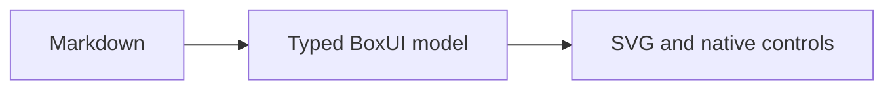

# BoxUI — interaktivt eksempel

Dette er en lokal prototype, ikke produksjonsstyring eller en akseptert SDL-regel.
Åpning av dokumentet starter ingen aktivitet. Velg **View → BoxUI prototype**
for å starte en uttrykkelig merket, syntetisk økt. Slå av/på for å starte på nytt.

## Activity og kontekst

1. Kontroller målingen og konteksten C1.
2. Trykk Suspend, deretter Resume: samme Activity A1 og fremdrift beholdes.
3. Trykk Suspend, skriv C2 og trykk Enter: Resume avvises på grunn av endret kontekst.
4. Tekst som bare er skrevet, men ikke sendt med Enter, er et utkast. Escape
   gjenoppretter akseptert verdi. Lagre Markdown eller eksporter PDF sender ikke utkastet.

```boxui
boxui 0.1
{
  "profile": "boxui/0.1",
  "documentId": "activity-demo",
  "bindings": [
    {
      "id": "measurement",
      "role": "value",
      "type": "number"
    },
    {
      "id": "context",
      "role": "value",
      "type": "string"
    },
    {
      "id": "set-context",
      "role": "command",
      "type": "string"
    },
    {
      "id": "suspend",
      "role": "command",
      "type": "none"
    },
    {
      "id": "resume",
      "role": "command",
      "type": "none"
    }
  ],
  "root": {
    "id": "panel",
    "kind": "column",
    "version": 1,
    "children": [
      {
        "id": "heading",
        "kind": "text",
        "version": 1,
        "text": "Simulert Activity — ikke produksjonsstyring"
      },
      {
        "id": "measure",
        "kind": "value",
        "version": 1,
        "label": "Måling (mm)",
        "valueBinding": "measurement"
      },
      {
        "id": "context-input",
        "kind": "input",
        "version": 1,
        "label": "Arbeidskontekst",
        "valueBinding": "context",
        "commandBinding": "set-context"
      },
      {
        "id": "actions",
        "kind": "row",
        "version": 1,
        "children": [
          {
            "id": "pause",
            "kind": "button",
            "version": 1,
            "label": "Suspend",
            "commandBinding": "suspend",
            "size": {
              "grow": 1
            }
          },
          {
            "id": "continue",
            "kind": "button",
            "version": 1,
            "label": "Resume",
            "commandBinding": "resume",
            "size": {
              "grow": 1
            }
          }
        ],
        "size": {
          "grow": 0
        }
      },
      {
        "id": "state-view",
        "kind": "diagram",
        "version": 1,
        "label": "Dokumentert livsløp, ikke kjørbar tilstandsmaskin",
        "family": "stateDiagram-v2",
        "source": "stateDiagram-v2\n[*] --> Running\nRunning --> Suspended: Suspend\nSuspended --> Running: Resume accepted",
        "size": {
          "min": 160,
          "grow": 1
        }
      }
    ]
  }
}
```

## Vanlig Markdown beholdes

[Forfatterveiledning](docs/design/boxui-authoring.md). Merk og kopier denne teksten.


