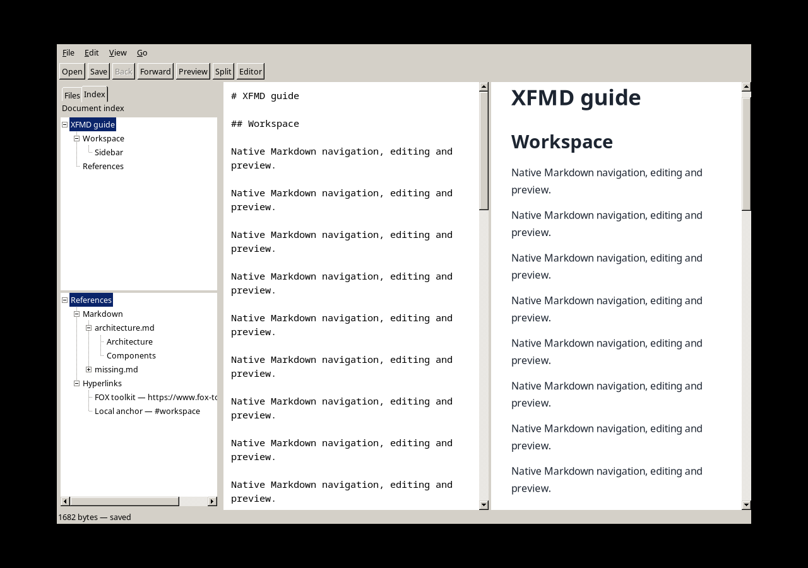

# P15 — dokumentindeks og referanser

Dato: 2026-09-13. M1 `33634d6`, M2 `2d187cd`; M3-commit inneholder denne rapporten.
Bygget på AlmaLinux/X11, FOX 1.6.57, cmark-gfm 0.29.0.gfm.13. GUI under egen
Xvfb med midlertidig HOME; brukerens desktop og åpne XFMD ble ikke styrt.

## Gjennomført verifikasjon

- Release: `cmake --build build-release -j 3`; full
  `ctest --test-dir build-release --output-on-failure -j 2`: **39/39** passerte.
- Etter reviewretting av Lagre som og deferred expand: IndexGuiTest samt
  DocumentIndexTest, ReferenceWorkerTest, ExternalBrowserTest, NavigationTest og
  SidebarGuiTest passerte på nytt.
- Separat Debug med `-DXFMD_SANITIZERS=ON`, samme seks tester: **6/6** passerte,
  ASan, UBSan og LSan. Ingen egne brede nye suppressions.
- `validate_blueprints.py`: 29 objekter / 43 krav. `check_blueprint_symbols.py`:
  165 implementerte callees. `check_layers.py` og `git diff --check` passerer.

AT-040: native faneklikk, F10 og bevart buffer. AT-041: nesting, nivåhopp,
UTF-8-headingtekst, source-byte, editor/preview, piltaster/Enter, live-redigering.
AT-042: relative escaped .md-stier, duplikater, tabell-lenker, toppnivå H2,
feilfil, filendring før navigasjon, dirty-cancel, back og Lagre som med ny lenkebase.
AT-043: blokkerende fake-leser etterfulgt av kansellering og ny forespørsel;
gammel jobb publiseres ikke. GUI stopper arbeid før avhengighetene destrueres.
Nettleseradapteren testes med en falsk xdg-open: URL med shell-tegn mottas som
ett uendret argument. Testen åpner ingen faktisk nettleser.

## Reviewfunn og rettinger

- FOX sender også SEL_CLICKED ved piltaster. Adapterne skiller reell pointer-click
  fra tastaturnavigasjon; Enter er eksplisitt aktivering. Dobbeltklikk på en fil
  gir ikke ny åpning etter enkeltklikket.
- Ingen nodepekere bæres over aktivering. FXTreeList kan kalle expandTree fra
  makeItemVisible; lazy lesing bestilles bare ved faktisk utvidelse. Mutasjon av
  barn og aktivering er utsatt til timere etter FOX-dispatch.
- Lagre som kan endre sti uten ny DocumentToken. Indeksen sjekker både token og
  sti før gamle handlinger får virke. Worker-generasjon avviser foreldede svar.
- Refererte kapittelposisjoner er snapshots. Etter filåpning finnes headingtekst og
  forekomst på nytt i akseptert modell. Forsvunnet heading faller tilbake til start.
- Application eier FOX/I/O/arbeidsflyt. Indeks bruker eksisterende semantikk,
  referanseleser får parserporten injisert; renderer kjenner ikke sidepanelet.

## Visuell kontroll og grenser

Kontrollert delt layout, heading-hierarki, Markdown/Hyperlinks, utvidet fil med
hovedkapitler og samtidige editor-/previewflater. Skillelinjen er FXSplitter;
scrollbarene bruker eksisterende scrollprofil. Lange lenker kan scrolles horisontalt.

Filoverskrifter lastes først ved utvidelse. Ny kollaps/utvidelse leser på nytt;
referansetrær er ikke rekursive. Én worker, maks 32 utestående jobber, 8 MiB per fil.
Blokkerende operativsystem-lesing kan ikke avbrytes midt i kall. Faner og ekspansjon
lagres ikke mellom oppstarter. Endring av aktiv buffer bygger trærne på nytt.
Fysisk touchpad er ikke testet; native X-events og sanitizere er brukt.

En kort 1 MiB-kontroll på batteri med `xfmd_cold_start` ga første visning
329,199 ms og peak RSS 90 944 KiB (88,8 MiB). Én prøve, ikke ny p95-måling;
innenfor SR-011s grenser på 500 ms og 100 MiB. Ingen langvarig batteritest.

Installert atomisk til `~/.local/bin/xfmd` fra Release-staging; `cmp` mot bygget
binærfil og desktop-file-validate passerte. Åpen brukerprosess ble ikke restartet.

M3-oppfølging: rotkapitler og References får også synlige +/−-bokser. Native klikk
på rotens bokser og på filens utvidelsesboks inngår nå i IndexGuiTest; Release og
ASan/UBSan/LSan-testen er kjørt på nytt etter denne visuelle justeringen.
