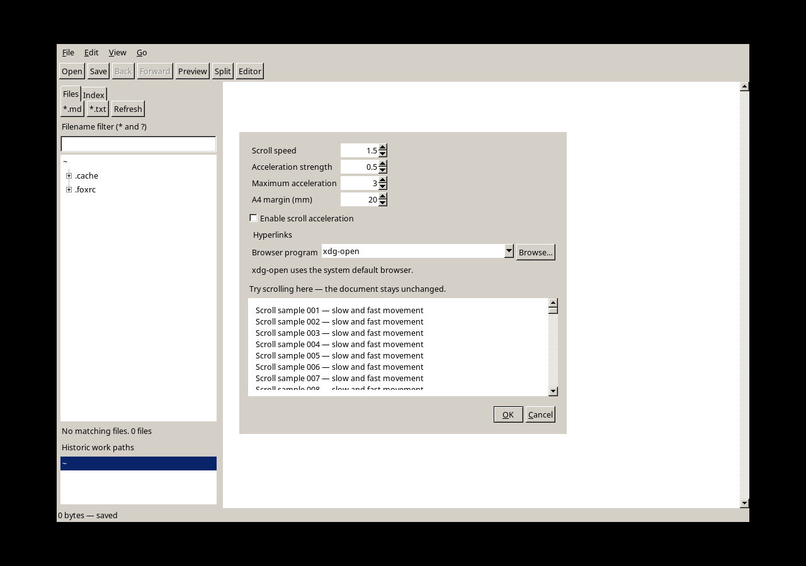

# P16 — nettleservalg og Xfe-studie

Dato: 2026-09-13. M1 `b1f4ffb`; M2 inneholder denne rapporten og studien.
Miljø: AlmaLinux/X11, FOX 1.6.57. Alle GUI-forsøk kjørt under separat Xvfb
med midlertidig HOME, uten styring av brukerens åpne vinduer.

## Implementasjon og review

UR-024 / AT-044 utvider eksisterende PreferencesService og FoxPreferencesStore
med `Programs/browser`; skjema 1 beholder bakoverkompatibel standard `xdg-open`.
Dialogen tilbyr redigerbart programvalg og filvelger. OK lagrer, Cancel forkaster.
Det lagres ett programnavn eller en full sti, ikke en shell-kommandolinje.

Preview og referanser går begge gjennom `Application::openBrowser`, som leser
aktiv preferanse ved hvert klikk. Program og URL sendes separat til posix_spawnp;
dokument og navigasjonshistorikk endres ikke. Adapterens eksisterende grense på
16 utestående starter og asynkrone opprydding beholdes. Spawn-feil peker tilbake
til Preferences. Deteksjon av senere feil inne i nettleseren inngår ikke.

Review kontrollerte spesielt felles ruting, kontrolltegn/NUL, programsti med
mellomrom, lagringsfeil og ukjente registry-nøkler. FOX 1.6 sin ettarguments
FXComboBox::setText brukes. Ingen interpreter-/renderer-avhengigheter er endret.

## Utførte kontroller

- Release: `cmake --build build-release -j 3`, deretter full
  `ctest --test-dir build-release --output-on-failure -j 2`: **40/40** passerte.
- Debug ASan/UBSan/LSan: PreferencesTest, ExternalBrowserTest og
  BrowserPreferencesTest: **3/3** passerte.
- PreferencesTest kontrollerer commit/cancel, diskinnlesing fra ny FXRegistry,
  ugyldige verdier og bevart gammel nettleser ved skrivefeil.
- ExternalBrowserTest bruker falske programmer og verifiserer uendret URL som
  ett argument, også med shell-tegn og programsti med mellomrom. Manglende
  program og tom/NUL-verdi gir feil. Ingen faktisk nettleser ble startet.
- BrowserPreferencesTest setter feltet i en ekte FOX-dialog og følger begge
  applikasjonskoblingene, preview og referanser. Den kontrollerer Cancel og
  programfeil uten dokumentbytte. Selve native lenkeklikket dekkes av eksisterende
  pointer-/indekstester i den fulle suiten; den nye testen kaller callback-seamene.
- `validate_blueprints.py`: **29 objekter / 44 krav**;
  `check_blueprint_symbols.py`: **166 callees**. Laggrensekontroll og diff-check passerte.

## Visuell kontroll og installasjon

Dialogen er kontrollert for plass til nettleserfelt, Browse, eksempelområde og
OK/Cancel. Skjermbildet viser portabel standard; `google-chrome-stable` finnes
som valg og er tilgjengelig på brukerens PATH. Dette endrer ikke systemets
standardnettleser. Åpen XFMD må åpnes på nytt for å laste ny programkode.

Release er installert via staging og atomisk erstatning av `~/.local/bin/xfmd`.
`cmp` mot bygget binærfil og `desktop-file-validate` passerte. Brukerens aktive
XFMD ble ikke avsluttet eller restartet, og brukerens registry ble ikke redigert
bak ryggen på en kjørende prosess.

## Studie og avgrensning

[Xfe-studien](../xfe-integration-study.md) bygger på pinned upstream og lokal
fork. Diffen viser kun automount-endringen i vår fork; moderncontrols og
foxhacks kommer fra upstream. Kildelesingen omfatter byggelister, xfw-init,
komponentavhengigheter, ikonlasting, globale overrides og relevante innstillinger.

Anbefalte P17–P19 er videre design, ikke implementerte Xfe-widgets eller et
utprøvd delt bibliotek. Ingen Xfe-kode eller ikonressurser er kopiert inn.
Det er ikke kjørt langvarige batteritester eller fysiske touchpad-forsøk i P16.
