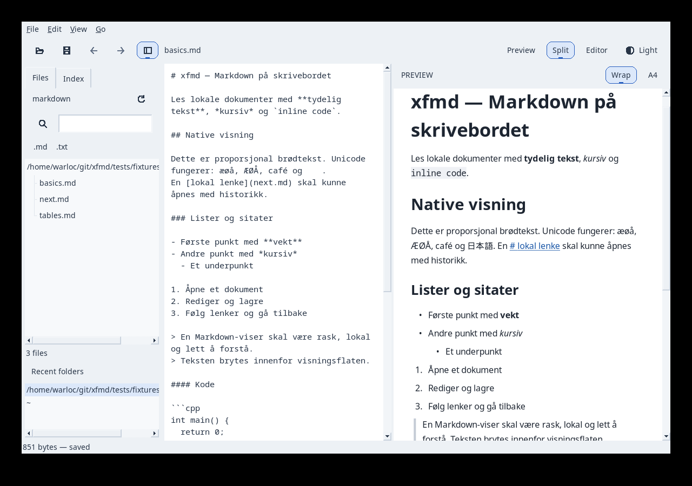
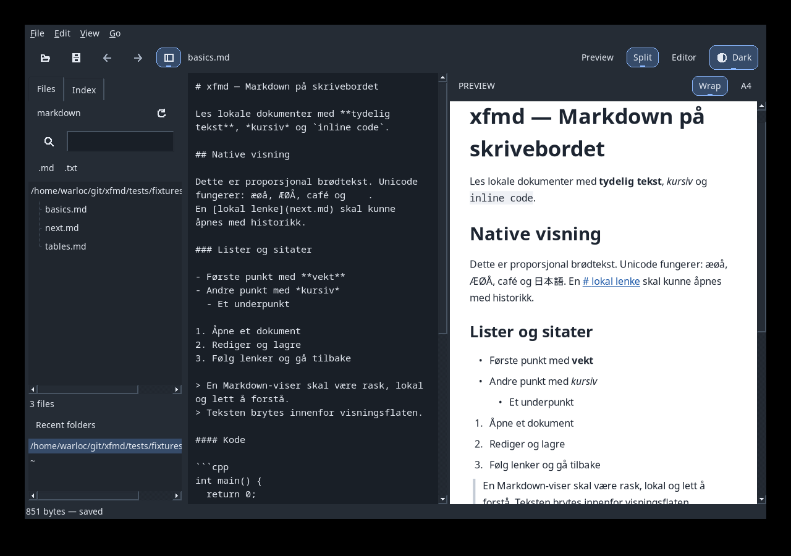
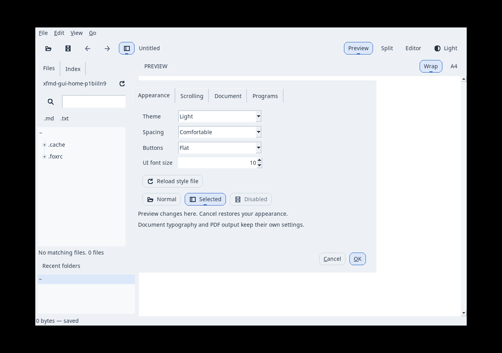
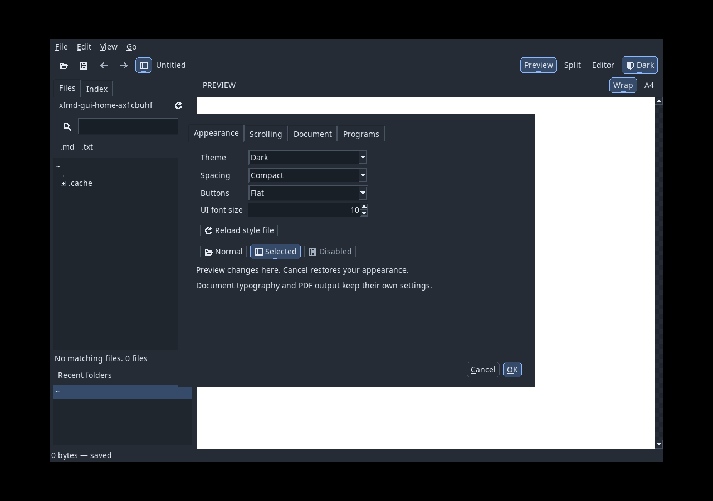
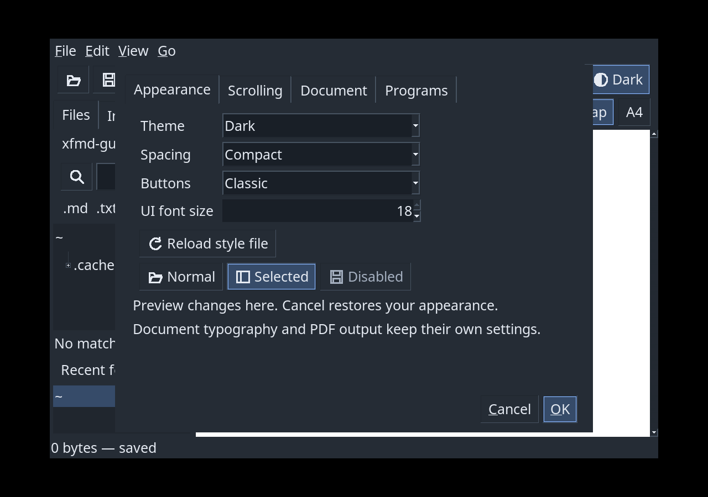
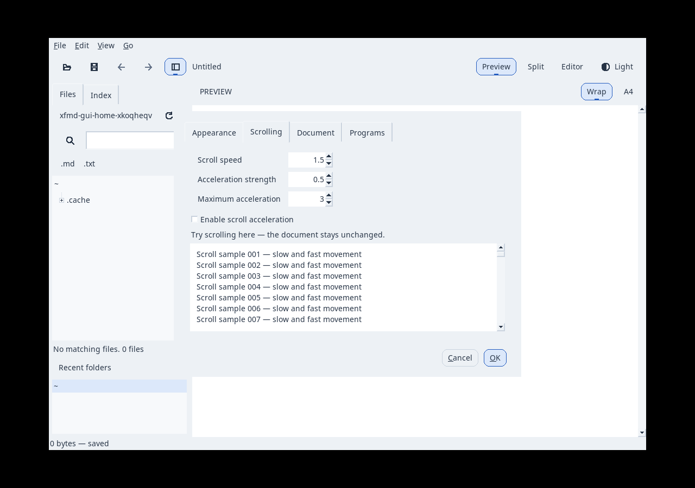

# P17–P19: integrert FOX UI og Appearance

Dato: 2026-09-14. Lokal Release på AlmaLinux/X11; GUI-tester bruker eget Xvfb
og midlertidig HOME/XDG_CONFIG_HOME. Brukerens desktop/dokument ble ikke betjent.

## Krav og milepæler

- UR-025 / AT-045: profiler, komponenter og persistens. ThemeProfilesTest,
  PreferencesTest, UiControlsTest og AppearanceGuiTest.
- UR-026 / AT-046: toolbar, eksklusive modusvalg, smal layout og navigasjon.
  AppearanceGuiTest, SidebarGuiTest, IndexGuiTest og eksisterende native tester.
- UR-027 / AT-047: Appearance/Scrolling/Document/Programs med ett draft.
  AppearancePreferencesTest: preview, native Escape/Enter, close, commit,
  simulert skrivefeil, bevart draft, toolbar som bevarer andre valg, profilrollback.

P17 M0 `1e158b3`, M1 `2caac7c`, M2 `69f77c1`; PR #10.
P18 M1 `41a9748`, M2 `23a2cd4`, native testaktivering `22bfcd6`; PR #11.
P19 M1 `beb3b26`, M2 `9f110b6`; M3 identifiseres i [PR #12](https://github.com/Hans-Einar/xfmd/pull/12).

## Gjennomgang og rettinger

Arkitektur: UI-laget ligger i application og har ikke nye parser-/renderer-
avhengigheter. Normal FOX-input, CommandRouter, dokumentmodell og PDF beholdes.
Design: få containere og en utskiftbar painter; ingen generell Window-hierarki
eller import av Xfe. Menyene beholder alle kommandoer ved smal toolbar.

Implementasjonsreview avdekket og rettet:

1. FOX engaged-state låser en vanlig toggle; UiButton har nå separat checked.
2. Disabled-ikoner må opprettes som native ressurser før første tegning.
3. Stilvandringen skal ikke endre X-root-vinduets bakgrunn.
4. Native fokus må aktiveres eksplisitt i PresentationTest uten en window manager.
5. FOX kan returnere fra runWhileEvents ved en utsatt expose med flere hendelser
   igjen. Tastaturtesten tømmer hendelseskøen før den sender Escape/Enter.
6. Profil-reload må kunne angres sammen med Appearance-utkastet; dialogen beholder
   opprinnelig og utprøvd profilkopi. Ekstern profilfil skrives ikke om.

## Verifikasjon

Samlet lokal Release-suite etter P19-M1: **44/44 bestått**, 72,46 s.
Åtte målrettede ASan/UBSan/LSan-tester: **8/8 bestått**, 11,45 s.
Etter siste profilrollback og hendelseskø-hjelper bestod **6/6 Release** (5,22 s)
og **6/6 ASan/UBSan/LSan** (6,10 s). Alle berørte C++-enheter ble bygd på nytt etter
en lokal stale objektfil i PreferencesTest; den rene CI-byggingen er sluttgate.
Ingen lang batteri-/soak-test.

Logger: [Release](P17-P19/release.txt), [siste Appearance-tester](P17-P19/appearance.txt)
og [siste sanitizer-tester](P17-P19/sanitizers.txt). Blueprint-struktur (29 objekter,
47 krav), 170 dokumenterte kall, laggrenser og git diff --check passerer.

GUI-testene omfatter native knapp/Space, Escape/Enter, eksklusivt valg,
Light/Dark-persistens, font18/compact, fallback ved 450 px, profilvalidering,
Cancel/close/skrivefeil og bevarte dokument-/papiridentiteter. Den samlede suiten
inkluderer scrolling, musegrab, indeks/referanser, PDF-tekst/raster og Window Maker
fullscreen. Fysisk touchpad, andre DPI-oppsett og subjektiv brukeropplevelse er
ikke erklært verifisert av automatiseringen.

## Produksjonsskjermbilder

Disse er tatt med produksjonsklassene i en separat FOX-prosess på Xvfb, uten WM-
dekorasjoner. De er ikke tegnede forslag. CaptureAppearance/CapturePreferences
bruker samme ressurser, kommandoer og renderer som appen. Alle bildene ble inspisert;
label-avkorting ved font18 og uferdige expose-hendelser ble rettet før siste opptak.

## Kort ytelseskontroll

Samme 1 049 346 bytes-corpus som P14, SHA256
`cc310b886cc2cd9f340377c1b1a54b8ef5176dbcf2bd21d7764220450d985a82`.
Én prosessoppstart til interaktiv preview: **247,885 ms**, peak RSS **89 048 KiB**
(ca. 87 MiB). [Råresultat](P17-P19/cold-start.txt). Dette er en kort kontroll,
ikke en p95-måling eller bevis på identisk ytelse på andre maskiner. Ingen ny
browser-/GTK-prosess eller renderer-avhengighet er lagt til.

## Integrasjon og installasjon

P17 [PR #10](https://github.com/Hans-Einar/xfmd/pull/10) og P18
[PR #11](https://github.com/Hans-Einar/xfmd/pull/11) er flettet etter godkjent
Release/sanitizer-CI. P19 [PR #12](https://github.com/Hans-Einar/xfmd/pull/12)
kjører samme rene byggmatrise før merge. Fasebranchene beholdes.

Installasjonen stages med CMake og publiseres atomisk til ~/.local/bin/xfmd.
Eksisterende XFMD-prosesser og åpne dokumenter fortsetter; nytt UI brukes ved
neste oppstart. Eksempelprofilen installeres som dokumentasjon og kopieres ikke
automatisk over brukerens appearance.ini eller preferanser.

FOX-hendelsesdetaljen i reviewet er kontrollert mot
[FOX 1.6 FXApp.cpp](https://sources.debian.org/data/main/f/fox1.6/1.6.50-1/src/FXApp.cpp).
