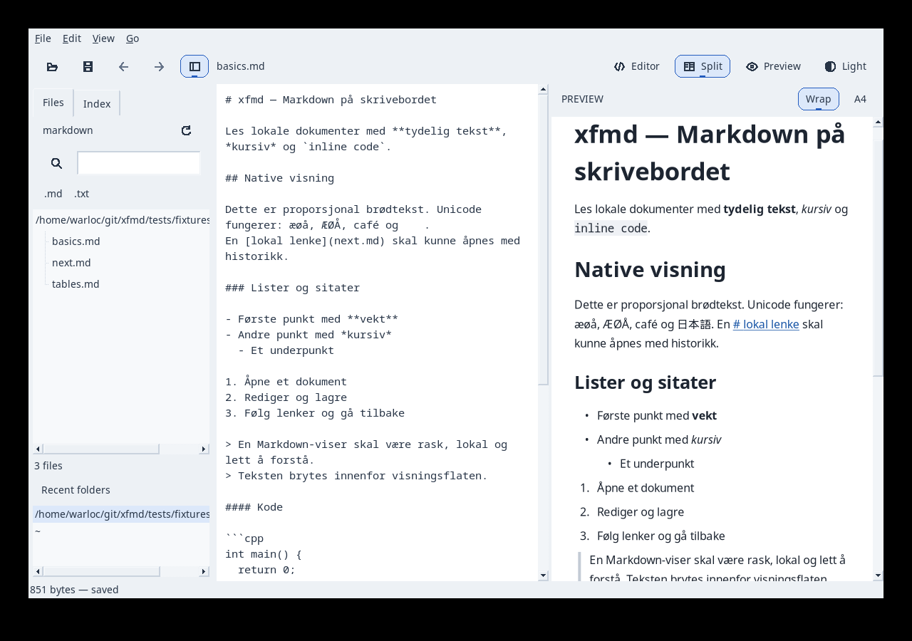

# P20: trehandlinger og stabil Split

2026-09-14. UR-028/AT-048, UR-029/AT-049 og presisert UR-026/AT-046.
M1: 7e4d159. M2: 7eb8346. M3: dokumentasjon/installasjon og fase-PR.

## Reprodusert feil og retting

[Geometritesten før retting](P20/before-fix.txt) feilet etter Editor → Split:
preview hadde ikke brukbar bredde. FOX utvider eneste synlige splitterbarn til
full bredde, og den bredden ble brukt uendret ved retur. Tidligere tester sjekket
bare shown(), som fortsatt var true selv om panelet ikke hadde plass.

ViewModeController husker nå editorens andel av en gyldig deling og gjenoppretter
begge bredder ved retur til Split. En eksplisitt Split-handling gjenoppretter også
et kollapset panel. AppearanceGuiTest måler reelle bredder, beholdt andel etter
resize og gjentatte bytter, samt toolbar-rekkefølge og tre distinkte ikoner.

## Filåpning og tastatur

Files aktiverer .md/.txt med samme InputPolicy og dirty-transaksjon som før.
Andre regulære filer starter xdg-open asynkront med én kanonisk absolutt sti som
argv. Filnavn evalueres aldri av et shell. Starteren har inntil 16 aktive jobber;
exitstatus høstes med waitpid/WNOHANG og feil vises i appen. Åpne-dialogen, CLI og
preview-lenkers typepolicy er ikke gjort om til ekstern filaktivering.

TreeActionsTest bruker en lokal falsk xdg-open under isolert HOME/PATH og ekte
X11-tastetrykk. Den kontrollerer Right/Space/Enter, bokstavelige mellomrom,
apostrofer og shell-metategn i filnavn, én argv-sti, bevart dirty/undo/dokument,
store .MD-suffikser, dirty-cancel og xdg-open exitfeil. En mappe med .md-suffiks
forblir mappe. Begge Index-treene kontrolleres med leaf-aktivering og lazy grener;
Right utvider grenen uten å åpne dens dokument. Ingen faktiske eksterne apper
ble startet av testene.

## Review og verifikasjon

- [Seks målrettede native Release-tester](P20/release.txt): 6/6, 19,50 s.
- [Fem ASan/UBSan/LSan-tester](P20/sanitizers.txt): 5/5, 19,79 s.
- Blueprint-struktur (29 objekter, 49 krav), 173 dokumenterte kall, laggrenser
  og git diff --check passerer.
- Fase-PR kjører hele rene CI-matrisen før merge. Ingen ny runtime-avhengighet.

Review: filaktivering går gjennom eksisterende kø med eide stier, ikke beholdte
FXTreeItem-pekere. Lazy-grener skiller seg fra leaf selv før barnene er lest.
Polling endrer ikke dokumentmodellen; desktop-programmer stoppes ikke når XFMD
avsluttes. Split-andelen gjelder økten og endrer ikke lagringsformatet.

## Produksjonsbilde og installasjon

Bildet er tatt med produksjonsappen i isolert Xvfb og er visuelt kontrollert.
Installasjon stages med CMake og binæren publiseres atomisk i ~/.local/bin.
Eksisterende XFMD-vinduer beholdes; start XFMD på nytt for å bruke endringen.
