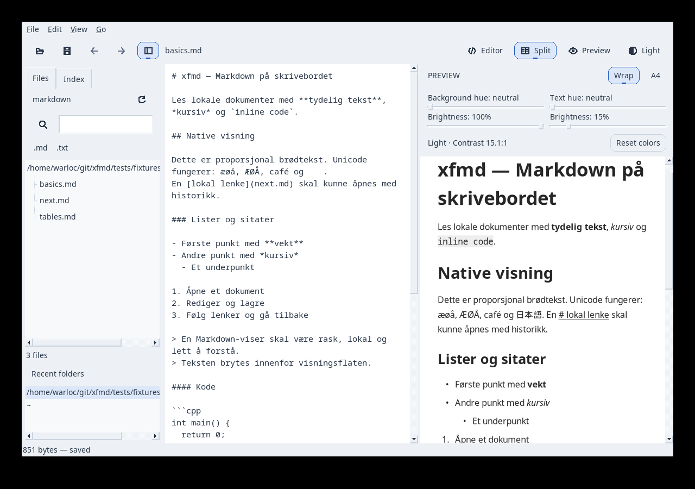
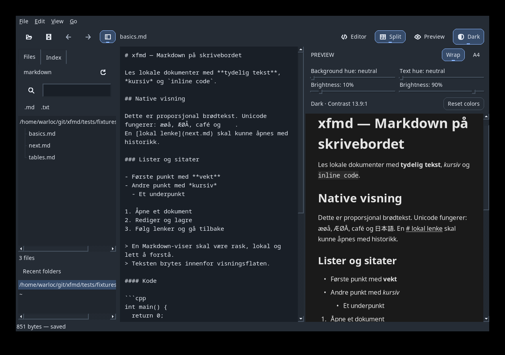
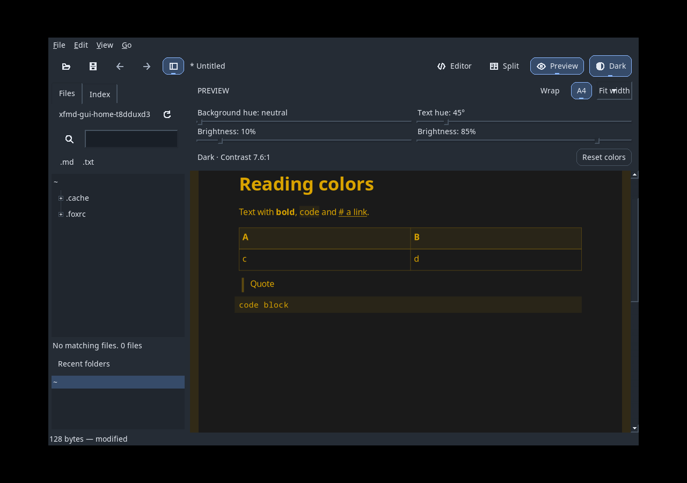

# P21: lesefarger og temaspesifikk persistens

2026-09-15. UR-030/AT-050 og UR-031/AT-051; presisert UR-025/AT-045.
M1: b6f934a. Implementasjonen som er testet: M2 9b259a9.

## Resultat og plumbing

PreviewColorControls sender levende verdier til Application::changeReadingColors.
FoxRenderHost tegner eksisterende RenderFrame med ReadingPalette, mens avsluttet
input committer aktiv Light- eller Dark-profil gjennom PreferencesService og
FoxPreferencesStore. Ved skrivefeil gjenopprettes lagrede verdier i host og sliders.
Application::applyAppearance velger riktig profil også under Preferences-preview
og Cancel. PDF bruker fortsatt opprinnelige farger; DecorationRole bevares gjennom
paginering. Ingen ny parsing, forming eller dokumentmutasjon er nødvendig.

## Testbevis

Miljø: Linux x86_64, GCC 14.3.1, FOX 1.6.57, cmark-gfm 0.29.0.gfm.13,
Pango/Cairo og isolert Xvfb/HOME. Window Maker brukes av FullscreenTest.

- `cmake --build build-release --parallel 4` og
  `ctest --test-dir build-release --output-on-failure`: [47/47 bestått](P21/release.txt), 91,27 s.
- `cmake --build build-asan --parallel 4` og
  `ctest --test-dir build-asan --output-on-failure`: [45/45 bestått](P21/sanitizers.txt), 100,57 s.
  ASan/UBSan/LSan med eksisterende dokumenterte tredjepartssuppressions.
- ReadingColorsTest kontrollerer RGB/kontrast, alle dekorasjonsroller i wrap/A4,
  Cairo-piksler for valgt tekst/dekorasjon og uendret standardpalett for PDF.
- ReadingColorsGuiTest sender native press/motion/release: repaint før commit,
  bevart frame/revisjon/scroll, temabytte, Preferences-Cancel og reell skrivefeil.
  Testen starter deretter en ny prosess som leser begge lagrede profiler og
  kontrollerer at sliders og preview følger aktivt tema.
- PreferencesTest dekker manglende/ugyldige/fractional/NaN-verdier og separat lagring.
- PDF-eksport/fidelity, lenker, scrolling, fokus, smal arbeidsflate og fullscreen
  inngår i de komplette regresjonssuitene.
- Blueprint-struktur: 29 objekter/51 krav; 178 plumbing-kall; laggrenser og
  `git diff --check` består etter avsluttende dokumentasjonsreview.

To eldre GUI-tester feilet først fordi runWhileEvents ikke tømte alle native
hendelser før geometri-/fokusasserts. PresentationTest og WheelGuiTest bruker nå
prosjektets eksisterende drainEvents. Alle opprinnelige assertions beholdes.
Tidlige kjøringer ble også avbrutt med SIGTERM; bevisene over inneholder komplette
sluttrapporter, ikke resultater fra de avbrutte kjøringene.

## Visuell kontroll og begrensninger

Produksjonskontroller og renderer er kontrollert i isolert Xvfb:

Forskningsgrunnlag og skillet mellom én UI-farge og monokromatisk lys er beskrevet
[i designnotatet](../design/reading-colors.md). Kontrastmåleren gjelder vanlig
tekst mot dokumentbakgrunn; den er ingen klinisk komfortmåling eller sertifisering
av hele grensesnittet. Fysisk touchpad, monitor/DPI og individuell lesekomfort er
ikke verifisert av de automatiske testene. Blueprint-status beholdes Implemented.

## Installasjon og integrasjon

Debug-binæren i build er oppdatert. Release er staged med CMake og installert
atomisk i ~/.local; SHA-256 for installert binær og build-release/xfmd er identisk:
`6d3b005b2f07d3a70291db8c2ad5667475a5b6f5926a29ec8b5b33afb3e96f72`.
Eksisterende brukerprosesser er ikke stoppet. Neste oppstart bruker endringen.
Fase-PR bruker repositoryets komplette CI-matrise som merge-gate.
