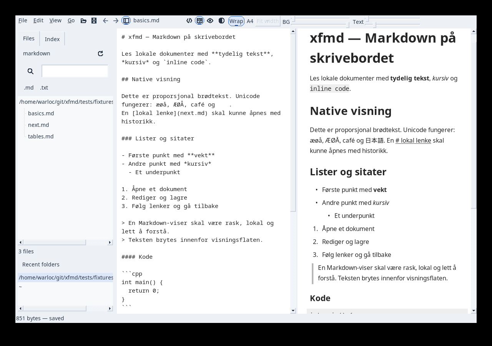
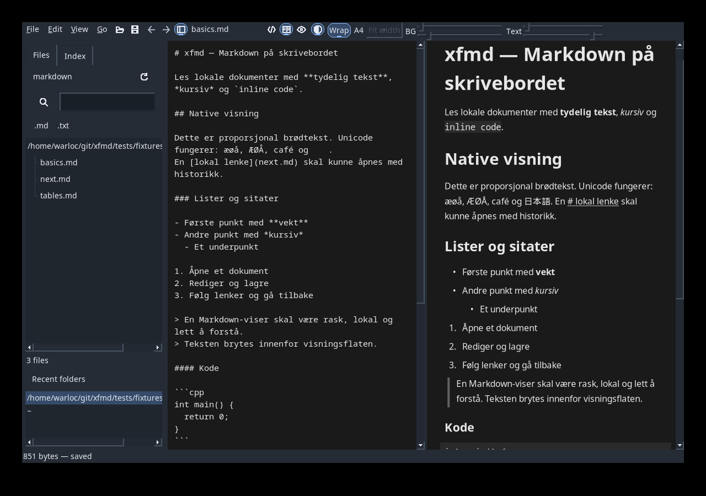
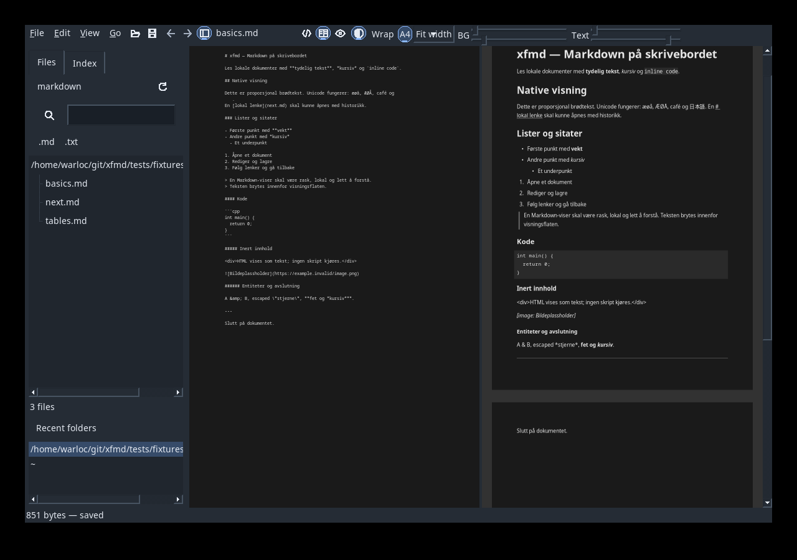
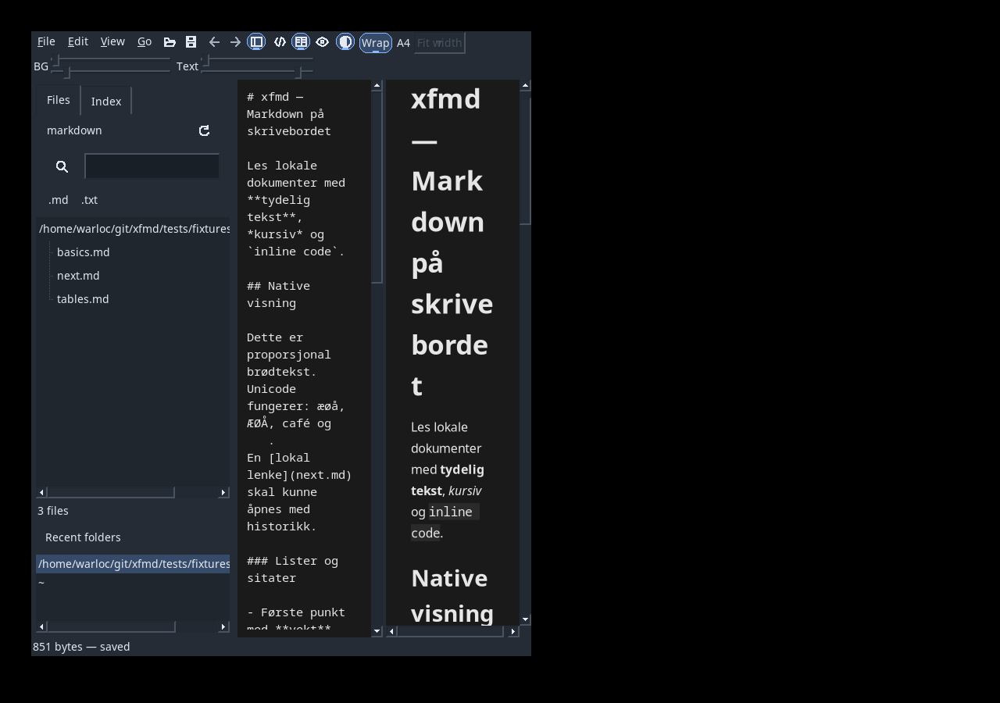

# P22: kompakt topplinje og delte dokumentkontroller

2026-09-15. UR-032/AT-052, UR-033/AT-053 og UR-034/AT-054.
M1 b89149d; M2 35400a9. M3 inkluderer siste Fit width-retting og testbevis.

## Resultat og eierskap

CompactToolbar grupperer meny, handlinger, format og farger på én lav rad.
Grupper brytes ved liten bredde. Filnavnet vises når det er plass; handlinger
beholder tooltip, CommandRouter-ID og tastatursnarvei. UiButton har eksplisitt
kompakt variant for topplinjen; andre dialog-/kontrollmål beholdes.
PREVIEW-tittel, kontrasttekst og Reset-knapp er fjernet.

ApplicationAppearance sender samme lagrede eller levende palett til FoxRenderHost
og EditorWidget. Begge Light/Dark-profiler og rollback ved skrivefeil beholdes.
EditorPresentation.cpp eier redigerbar papirbredde og fontskalering. A4 i editoren
er kontinuerlig Markdown-kilde med papirbasert tekstbredde; preview viser sider.
FXText avrunder tegnbredder til hele piksler; Fit width tar hensyn til dette og
scrollbarbredden. 100% bruker normal editorfont, og Wrap følger vindusbredden.
Svært smale flater begrenses av minste editorfont på 3 punkt.

Hostens hit-test varsler Application::showLinkTarget. LinkResolver::localPath
løser relative dokumentstier uten å åpne filer. Nettadressen vises som den er.
Leave, scrolling, skalering og frame-invalidering fjerner gammelt hover-mål.
Status som er oppdatert av en annen handling blir ikke overskrevet ved Leave.

## Verifikasjon

Miljø: Linux x86_64, GCC 14.3.1, FOX 1.6.57, Pango/Cairo, isolert Xvfb/HOME.
Sanitizere bruker prosjektets eksisterende dokumenterte tredjepartssuppressions.

- CompactWorkspaceTest måler topplinje under 40 px ved 1100/1900 px bredde,
  og ikke-overlappende kontrollgrupper ved 640/450 px. Begge paneler har samme
  forelder for kontrollene; kontrollene beholdes i Editor-only.
- Testen kontrollerer editorfont, faste kolonner, Fit width uten horisontal
  overflyt, 100%, Wrap, bevart buffer/revisjon/markering og fungerende undo.
- Native musebevegelse tester oppløst relativ sti i Wrap/A4, nettadresse,
  absolutt sti, Leave og scrolling uten navigasjon/dokumentendring.
- ReadingColorsGuiTest kontrollerer fortsatt live dragging, lagring/rollback,
  Preferences-Cancel og separat Light/Dark etter ny prosess; editorfarge etter
  omstart er nå også kontrollert.
- PointerTest og AppearanceGuiTest identifiserer ikonknapper med kommando/state,
  fremfor fjernet knappetekst. Opprinnelige input-/grab-/navigasjonsasserts beholdes.
- Blueprint-struktur: 29 objekter, 54 krav, 183 dokumenterte kall; laggrenser
  og git diff --check består.

## Visuell kontroll

Bildene er tatt med produksjonskontroller/renderer i isolert Xvfb:

Dette er visuell og automatisert kontroll, ikke en fysisk touchpad-/DPI-test.
Blueprint-status beholdes Implemented. Ingen nye runtime-avhengigheter.

## Installasjon

Debug og Release er bygget. Release er staged med CMake og atomisk installert i
~/.local uten å stoppe eksisterende XFMD-prosesser. Start på nytt for ny versjon.
Installert binær og build-release/xfmd har samme SHA-256: `98f2fd2f552c55c746bc2d7d7a46ffd263954ac655c9f416bf452cf9fb979b19`.

## Komplette testkjøringer

- `cmake --build build-release --parallel 4`, `ctest --test-dir build-release --output-on-failure`: [48/48 bestått](P22/release.txt), 95.22 s.
- `cmake --build build-asan --parallel 4`, `ctest --test-dir build-asan --output-on-failure`: [46/46 bestått](P22/sanitizers.txt), 102.79 s.

Fase-PR kjører ren Ubuntu CI med og uten sanitizere før merge.
