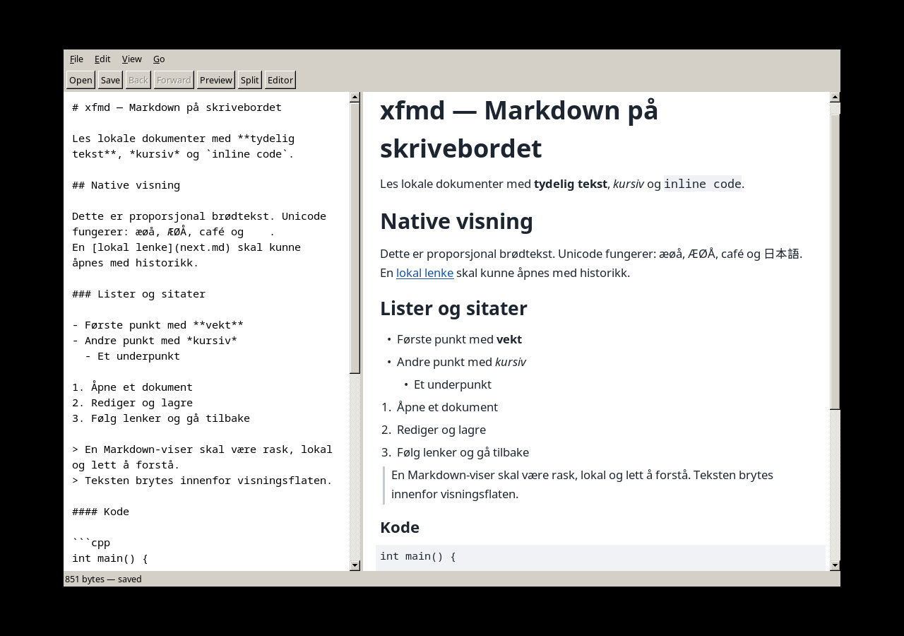

# P7 — samlet verifikasjon

Status: pågående sluttkontroll. Miljø: Fedora Linux, x86_64, Intel Core i5-7200U
2.50 GHz (2 kjerner / 4 tråder), GCC 14.3.1, FOX 1.6.57, cmark 0.31.1.
Release bruker CMake Release; ASan/UBSan bruker separat Debug-bygg.

## Ytelse (AT-021)

`xfmd_benchmark` genererer 1 049 346 bytes og kjører én kald og 30 varme runder
med faktisk FOX-fontmåling ved 900 pixels. p95 er sortert måling nummer 29 av 30.
Input SHA-256: `cc310b886cc2cd9f340377c1b1a54b8ef5176dbcf2bd21d7764220450d985a82`.

```sh
python3 tools/run_with_xvfb.py ./build-release/xfmd_benchmark /tmp/xfmd-benchmark.md
python3 tools/run_with_xvfb.py ./build-release/xfmd_cold_start /tmp/xfmd-benchmark.md
```

Målt varm p95: parse 35.78 ms, layout 52.60 ms, samlet 87.80 ms.
Benchmark peak RSS 49 804 KiB. Egen prosess fra oppstart til første tilgjengelige
frame og behandlet paint-event: 279.08 ms, peak RSS 81 520 KiB.
Dette er kald applikasjonsprosess, ikke tømt OS-filcache. Tallene gjelder dette
corpus/miljøet, ikke en garanti for alle dokumenter under 8 MiB.

Opprinnelig P7-måling var 361 ms / 142 MiB. Bounded tabulatorsøk fjernet gjentatt
skanning av resten av kilden; sammenhengende runs samles per linje; målecache har
4096 korttekstnøkler. Kildeområder og ulike fontmetrikker bevares ved sammenslåing.

## Akseptanse og bevis

| AT | Bevis |
| --- | --- |
| AT-001 | DocumentTest: Unicode/mellomrom/feilet åpning; WorkspaceTest: filfilter; main og dialog/sidepanel deler Application::open. |
| AT-002 | InterpreterTest/RendererTest/PresentationTest og visuelt P3-skjermbilde: overskrifter, native fonter, nesting, kode og wrapping. |
| AT-003 | DocumentTest/WorkspaceTest: roundtrip, undo/redo, dirty; accelerator-tabell for Ctrl+Z/Y/F/S. Clipboard bruker FXTexts native oppførsel. |
| AT-004 | PreviewTest: 300 ms falsk klokke; PresentationTest: ekte event loop, markør/fokus og siste token. |
| AT-005 | NavigationTest/NavigationGuiTest: branching, feil, dirty-cancel, ekte lenketreff og restore. |
| AT-006 | WorkspaceTest: filter/synlighet/F10-registrering; SidebarWidget-kallkart viser bare dobbeltklikk/kommando åpner. |
| AT-007 | WorkspaceTest: tre moduser, editor venstre, tilstand/undo bevares. |
| AT-008 | ScrollTest/ScrollingTest: begge retninger, wrapping, kode, resize og guards. |
| AT-009 | DocumentTest/NavigationTest: feil, konflikt, dirty-cancel og original beholdes. |
| AT-011 | PortContractTest og LayerBoundaries; separate CMake-targets. |
| AT-012 | Manuell review: DocumentSession eneste råteksteier, koordinatorer orkestrerer, widgets delegerer. |
| AT-013 | PortContractTest med fakes; InterpreterTest/RendererTest med ekte implementasjoner; immutable modeller. |
| AT-014 | cmark 0.31.1/CMARK_OPT_DEFAULT, InterpreterTest fixtures. Ingen full CommonMark-conformance-påstand. |
| AT-015 | InterpreterTest/NavigationTest avviser schemes og håndterer HTML/bilder inert; ingen shell/network-kall i koden. |
| AT-016 | DocumentTest: byte-for-byte BOM/blandede linjeslutt/Unicode og ugyldig UTF-8/NUL. |
| AT-017 | DocumentTest: konflikt, injisert pre-rename-feil, modus/xattr, symlink/hardlink. DiskFullFailure injiserer faktisk write→ENOSPC med strace. |
| AT-018 | PreviewTest/PresentationTest/NavigationGuiTest: gamle tokens, dokumentbytte, resize og bounded worker. |
| AT-019 | InterpreterTest/ScrollTest/ScrollingTest: byteankre, repeated text, kode, tilnærmede entiteter og wrapping. |
| AT-020 | PreviewTest: parser-worker og GUI-metrics, timeravregistrering/join. Sanitizer-suite og ytelse supplerer. |
| AT-022 | BlueprintStructure og manuell kontroll av plumbing/eierskap; validator er ikke AST-callgraph-verifikasjon. |
| AT-023 | Filkart og kildefilreview: separate roller, ingen generisk Manager/Utils, produksjonsfiler under 300 linjer. |

AT-010/024 er Future (xfw-IPC). Dialoger og utklippstavle bruker FOX; registrerte
akseleratorer og koordinatortester erstatter ikke full interaktiv desktop-akseptanse
på alle vindusbehandlere. Objektene står derfor Implemented med eksplisitt bevis,
ikke ubetinget Verified på bakgrunn av strukturell kontroll alene.

## Distribusjon og begrensninger

Installasjonsregler omfatter executable, desktop-entry, ikon, man-side og cmark-
notis. Prosjektlisens er uavklart med eieren; ingen formell GitHub-release eller
release-arkiv publiseres før dette er valgt. Avhengigheter lastes kun ved eksplisitt
bootstrap. CI bygger og tester på Ubuntu 24.04, med og uten sanitizers.

## Sluttkontroller og CI

M1-koden (`6a824d8`) bestod lokalt 14/14 Release-tester og 13/13 ASan/UBSan-tester
uten lekkasjesuppression. ENOSPC-testen bruker ptrace/strace og kjøres separat fra
LeakSanitizer, som ikke kan operere under ptrace. Ny BlueprintSymbols-kontroll
finner 83 Implemented-callees i dokumenterte filer.

Første [Ubuntu CI-kjøring](https://github.com/Hans-Einar/xfmd/actions/runs/34721786960)
bestod vanlig bygg, men LeakSanitizer fant 320 bytes i tre fontconfig-allokeringer
fra `FcInit → XftInit → FXApp::openDisplay`. GUI-testene har derfor en avgrenset
`leak:FcInit`-suppression, dokumentert i tests/support/lsan.supp. Applikasjonens
lekkasjesjekk er fortsatt aktiv; ingen generell detect_leaks=0 brukes.

Separat rent `BUILD_TESTING=OFF`-bygg og installasjon til `/tmp/xfmd-install-p7`
bestod. Installert `xfmd --version` gir 0.1.0 og `--help` fungerer uten display.
PresentationTest kjørt under `strace -f -e trace=network` hadde ingen AF_INET/
AF_INET6-kall; X11-kommunikasjonen gikk over AF_UNIX. Dette er runtime-bevis for
dette scenarioet, supplert av kontroll av alle ressurs-/lenkeinnganger.



Skjermbildet er fra eget Xvfb-display. Preview viser proporsjonale fonter, Unicode,
lister og kode; editoren bevarer CJK-bytes selv om den lokale monospace-fonten
mangler glyphene. Native fokus-testen aktiverer hovedvinduet eksplisitt siden
Xvfb-testmiljøet ikke har en vindusbehandler.

Etter symbolkontroll: 15/15 Release-tester og 14/14 ASan/UBSan-tester bestått.
`git diff --check` er ren. Største produksjonsfil er LocalFileStore.cpp (178 linjer).
