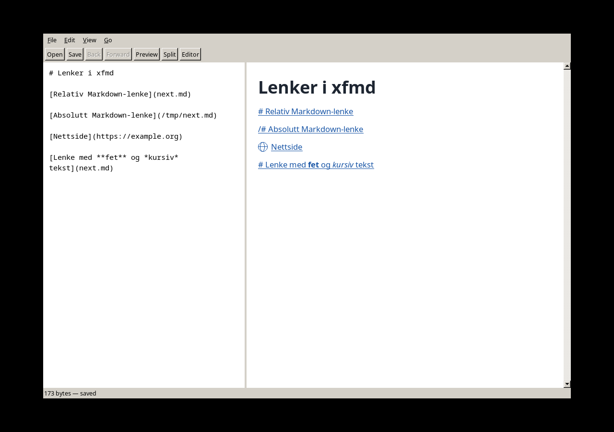

# Rettelse: native lenkeaktivering og lenkemarkører

Brukerfeilen ble gjenskapt ved å erstatte direkte onPointer-kall i NavigationGuiTest
med X11 ButtonPress/ButtonRelease gjennom FOXs event loop. Testen feilet før
rettelsen: FXScrollArea-host var ikke enabled. Konstruktoren kaller nå enable().
LinkResolver regnet allerede korrekt fra åpent dokuments absolutte foreldremappe;
den eksisterende beregningen er beholdt og verifisert ende til ende.

NavigationGuiTest oppretter filer i en egen midlertidig mappe, uavhengig av cwd.
Et native klikk på `#` åpner `../target%20folder/next.md`; etter tilbake/frem og
dirty-cancel testes native klikk på teksten i en absolutt dokumentlenke.

Rendererens LinkMarker viser # for relative .md-lenker, /# for absolutte og en
Globe-primitiv for HTTP(S). Marker og tekst deler treffmål. Link-ID fra interpreter
hindrer dupliserte markører ved fet/kursiv inne i lenken, men skiller to tilstøtende
lenker med samme URL. Syntetiske markører endrer ikke kildebytes eller offsetter.
Nettlenker identifiseres visuelt; policyen om ikke å åpne dem er uendret.

Kontrollert: 15/15 Release-tester og 14/14 ASan/UBSan-tester. RendererTest dekker
markørtyper, kildeankre, treff, stilfragmenter og tilstøtende like URL-er.
Skjermbildet er kontrollert visuelt på et isolert Xvfb-display.

