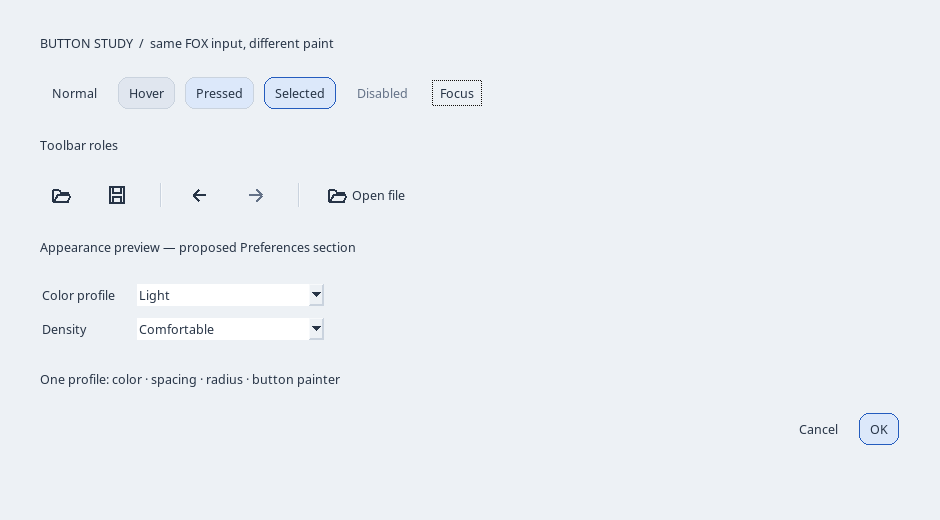

# FOX UI: et lite lag for et enhetlig og utskiftbart utseende

Dato: 2026-09-14. Status: **forslag**, med separat kjørbar FOX-prototype.
Produksjonsappen er ikke endret. [UX-forslaget](fox_ux_improvements.md) beskriver
hvilke handlinger som bør stå hvor; dette dokumentet beskriver hvordan de tegnes.

## 1. Mål og anbefalt omfang

Definer farger, mål, kontrollfont og ikonsett ett sted. La vinduer be om en
knapp med en bestemt rolle og handling, uten å bestemme farge, padding eller
tegningskode. Bytt profil for å sammenligne uttrykk med samme arbeidsflyt.

Begynn med knapper, verktøylinje, paneloverskrifter og dialogavstander. Behold
FOX for eierskap, layout, hendelser, menyer, tekstfelt, trær og splittere.
Ikke lag en parallell implementasjon av hele FOX, et CSS-system eller et
generelt plugin-rammeverk. Xfe trenger ikke legges inn som avhengighet.

## 2. Hva som finnes i dag

`XfmdWindow::buildUi` bygger en rad med sju tekstknapper. WorkspacePanel,
IndexPanel og PreferencesDialog oppretter og formaterer sine egne kontroller.
CommandRouter samler allerede kommandoer og enabled/checked-tilstand; den er
et godt fundament for felles menypunkter og knapper. EditorWidget og
NavigationTree har viktig inputatferd som skal beholdes.

FOX 1.6 støtter ikonknapper, flat `BUTTON_TOOLBAR`, farger, fonter, padding og
egne SEL_PAINT-handlere. Avrunding kan tegnes med FXDCWindow. Vi trenger ikke
redefinere FOX-metoder globalt slik Xfe gjør for å bruke disse mulighetene.

## 3. Én kilde for hver type stilvalg

| Foreslått verdi | Eksempler | Eier / hensikt |
| --- | --- | --- |
| Palette | surface, field, text, muted, border, accent, selected, danger, focus | Semantiske farger; ingen lokale RGB-konstanter i vindusbygging |
| Metrics | gapSmall=4, gap=8, groupGap=16, panelInset=12, controlHeight=32, iconSize=18, radius=5 | Logiske mål som skaleres én gang |
| Typography | UI-font og størrelse | Kontrollfont; endrer ikke automatisk dokument-/PDF-font |
| IconSet | open, save, back, forward, search, sidebar, exportPdf | Semantiske navn; samme ikon i meny og verktøylinje |
| ButtonAppearance | flat, outlined, classic; role=toolbar/normal/primary | Tegningsstrategi; input og kommandoer er uendret |
| Density | comfortable / compact | Kompakte mål, uten å gjøre ikoner og klikkflater uleselige |

Foreslått profilfil er enkel INI med et begrenset nøkkelsett. Valgt profil-id
lagres gjennom eksisterende PreferencesService. Lever profiler med appen;
brukerens override kan ligge i en separat, liten appearance-fil. Appspesifikke
valg som nettleser og scrollhastighet blir i eksisterende preferences.

Ugyldige farger og mål får valideringsfeil eller dokumentert fallback. Begrens
ikonstørrelser og filstørrelser; ikke last filer i paint-handleren. Theme-filer
skal ikke kunne kjøre programmer. Hold sist fungerende profil ved reload-feil.

## 4. Tynt mellomlag: arv der det passer, composition for utskiftbar tegning

Alle navn nedenfor er **foreslåtte produksjonsklasser**, ikke allerede innført:

| Klasse | Ansvar | Bygger på |
| --- | --- | --- |
| UiContext | Aktiv stil, ressurslevetid og stilrevisjon | Ett objekt eid av Application, injisert i UI |
| UiButton | Standardrolle, mål, tooltip og felles state til painter | FXButton med egen SEL_PAINT; normal FOX-input beholdes |
| ButtonPainter | Tegn bakgrunn, ikon, tekst og fokus gitt state/rolle | Liten virtuell tegningskontrakt; ingen dokumenttilgang |
| FlatButtonPainter / ClassicButtonPainter | To alternative uttrykk | Samme inngangsdata og knappeatferd |
| UiFactory | Velg konkret knapp-subklasse ved opprettelse | Setter UiContext og CommandRouter-target/selector |
| IconCatalog | Cache ressurser etter ikon-id, størrelse og palett | FXIcon, eventuelt egne kodebaserte symboler |
| ToolbarGroup / FormRow / PanelHeader / DialogActions | Avstander, justering og rekkefølge | FXHorizontalFrame / FXVerticalFrame / FXMatrix |

Eksempel på ønsket bruk, **pseudokode**:

```cpp
ui.button(toolbar, Action::Open, ButtonRole::Toolbar);
ui.button(dialogActions, Action::Accept, ButtonRole::Primary);
ui.useAppearance("graphite");
```

Et utseendebytte bytter palett og painter i UiContext, ikke widgetobjektene.
Dermed beholdes fokus, target/selector og pekere. En ny UiButton-subklasse kan
velges av factory før vinduet bygges, eksempelvis en Xfe-inspirert variant.
Å bytte selve C++-klassen på levende widgets bør ikke være første versjon.
Ingen dynamiske DLL-/SO-plugins er nødvendige; registrerte, innebygde varianter
gir samme eksperimenteringsmulighet med færre levetidsproblemer.

Et utseende må dekke normal, hover, pressed, disabled, checked, fokus og default.
Checked-state leses fra CommandRouter, ikke fra at knappen sist ble klikket.
Painter får en eksplisitt ButtonVisualState. GUI skal fortsatt kunne opereres
med tastatur, og valgt modus må vises med mer enn en vanskelig skillebar farge.

## 5. Layout er også en del av standardiseringen

En felles knappklasse alene standardiserer ikke vinduene. ToolbarGroup eier
avstanden mellom handlinger; DialogActions eier plassering av OK/Cancel;
FormRow justerer label og felt. Ingen generell Window-baseklasse skal overta
alle disse ansvarene. Bruk noen få små FOX-containere med navngitte mål.

Ved fargebytte: repaint. Ved endret font, density eller ikonmål: recalc/layout
før repaint. Bevar splitterposisjoner, dokumentanker og aktivt felt. Hvis endret
bredde utløser dokumentlayout, bruk eksisterende anker-/preview-koordinator.
Test minimumsbredde og lengre oversatte tekster; unngå absolutte koordinater i
produksjonslayouten. DPI og brukerens density skal ikke multipliseres dobbelt.

## 6. Rask prøving av ulike uttrykk

Foreslått Appearance-side i Preferences:

1. Velg Light, Graphite eller Classic, og Comfortable/Compact separat.
2. Forhåndsvis palett og samme sett av knappetilstander i en liten prøveflate.
3. Forhåndsvis hele appens kontrollutseende med et midlertidig snapshot.
4. OK lagrer. Cancel/vinduskryss gjenoppretter hele opprinnelige snapshotet.

En utviklerkommando «Reload appearance» kan gjøre redigering av INI-filen rask.
Den skal ikke være en permanent timer eller file watcher i første versjon.
Første produksjonsleveranse kan nøye seg med prøveflaten og bytte ved OK;
live-preview av hele appen innføres først når rollback er testet.

## 7. Visuelle forslag — faktisk FOX, isolert fra produktet

Bildene er tatt av en separat FOX 1.6-applikasjon under Xvfb. Kontroller er
native FOX, og ikon-/knappetegningen bruker FXDCWindow. Dokumentet er en statisk
illustrasjon, ikke XFMDs renderer. Bildene beviser tegningsmuligheten, ikke ferdig
produksjonsintegrasjon, kildeankre eller komplett tastatur-/scrollatferd.




Den reproduserbare [prototypen](docs/design/fox-ui-lab/README.md) har én profilfil
og utskiftbar knappetegning. Samme vindusbygger brukes til lys og mørk variant.
Classic bruker FOXs ordinære knappetegning. Prototypen er ikke et nytt produktbibliotek.

## 8. Integrasjon og en liten første leveranse

Plasser eventuell produksjonskode under `application/ui/style` og
`application/ui/controls`. UiContext får FOX-ressurser med tydelig levetid:
widgets destrueres før font-/ikonressurser; ingen hengende painter-referanser.
Behold renderer/interpreter uten UI-avhengigheter.

Dette utvider FUNC-010 (workspace), FUNC-014 (preferences) og eksisterende
CommandRouter-bindinger. Før implementasjon oppdateres krav og relevante
blueprints; nye knapper er ikke automatisk nye features. Denne studien endrer
ikke status på leverte funksjoner.

Anbefalt første scope er profil + ikonverktøylinje + felles spacing, omtrent
1–2 utviklerdager som grovt anslag. Utskiftbar painter og Appearance-prøveflate
kan følge som et eget, tilsvarende avgrenset steg. Trær, menyer og scrollbarer
beholder native tegning inntil en konkret visuell svakhet begrunner mer arbeid.

Målrettede produksjonstester: ugyldig profil, fallback, palette-/metric-revisjon,
OK/Cancel, én kommando per klikk/Space, disabled og checked, default/Enter,
synlig fokus, smalt vindu, 100/150/200 % skala, og eksisterende musegrab-/scrolltester.
Mål oppstart og RSS før/etter med samme dokument; prototypen gir ikke en slik sammenligning.
