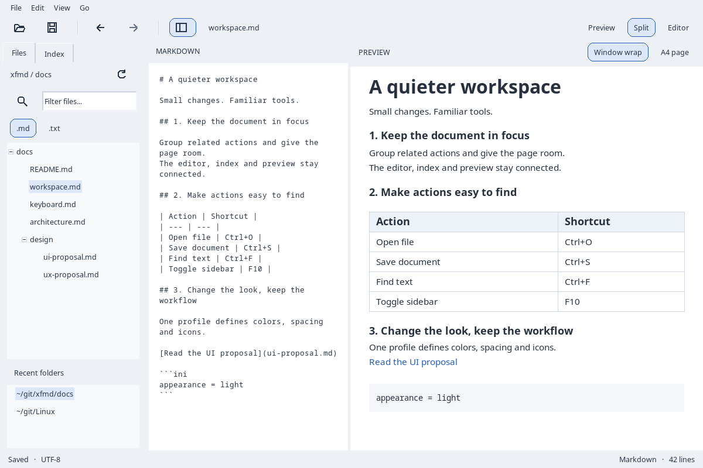
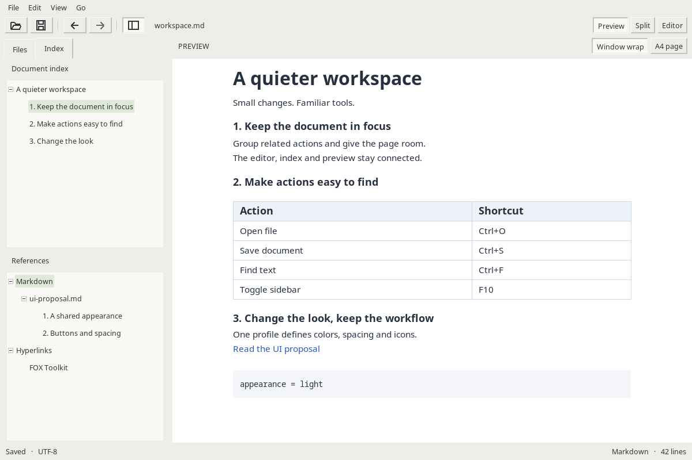
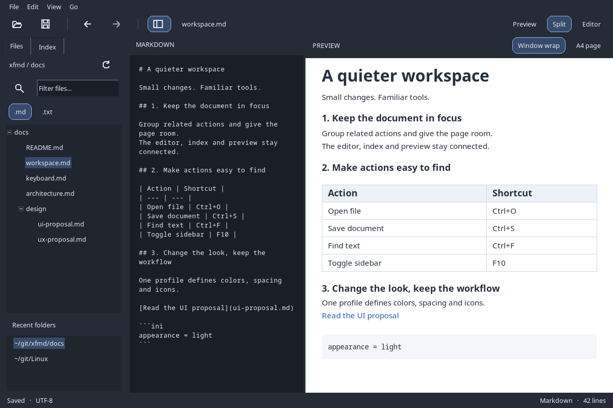

# FOX UX: færre konkurrerende kontroller og tydeligere arbeidsflate

Dato: 2026-09-14. Status: **forslag**, ikke nye funksjoner i installert XFMD.
[UI-forslaget](fox_ui_improvements.md) beskriver stilprofiler og widgetlaget.

## 1. Retning

XFMD skal fortsatt være en enkel Markdown-viser/editor. Prioriter lesing,
navigasjon og små redigeringer. Gjør eksisterende funksjoner lettere å finne,
uten å introdusere dokumentfaner, docking-system eller en ny vindusmodell.

Den største umiddelbare gevinsten er en gruppert ikonverktøylinje med tydelig
valgt visningsmodus. Behold menylinjen som fullstendig, lesbar kommandoliste.
Ikoner reduserer visuell støy, men ukjente funksjoner trenger tekst eller tooltip.

## 2. Dagens friksjon og foreslått forbedring

| Dagens UI | Foreslått endring | Brukerfordel |
| --- | --- | --- |
| Open, Save, Back, Forward og tre visningsmoduser står i én lik knapperekke | Grupper filhandlinger, navigasjon og visning; bruk ikonknapper der symbolene er kjente | Lettere å skanne og forstå sammenhenger |
| Modusknappene ser ut som vanlige handlinger | Ett eksklusivt valg: Preview / Split / Editor, med tydelig valgt tilstand | Synlig hvilken arbeidsflate som er aktiv |
| Filfilter, Refresh og historikk konkurrerer med filene | Kompakt filterrad; Refresh ved filoversikten; historikk i nedre seksjon | Mer plass til filer uten å miste funksjoner |
| Index/References er funksjonelt delt, men svakt strukturert visuelt | Rolige seksjonsoverskrifter, konsekvent innrykk og tydelig valgt kapittel | Lettere å orientere seg i lange dokumenter |
| A4 og wrap ligger bare i View | Et lite, tekstmerket valg ved preview; zoom kun relevant i A4 | Kobler kontrollen til flaten den påvirker |
| Preferences blander scrolling, papir og nettleser i én flate | Små faner eller seksjoner Appearance, Scrolling, Document, Programs | Raskere å finne riktig innstilling |

## 3. Verktøylinje og kommandoer

Foreslått rekkefølge fra venstre:

| Gruppe | Kontroller | Atferd |
| --- | --- | --- |
| Dokument | Open, Save | Ikon, tooltip og snarvei. Save disabled når dokumentet ikke kan/behøver lagres, etter eksisterende policy |
| Navigasjon | Back, Forward | Disabled når historikken ikke tilbyr retningen |
| Arbeidsflate | Sidebar | Synlig checked-state; behold F10 |
| Visning, mot høyre | Preview / Split / Editor | Eksklusivt valg med tekst; behold Ctrl+1 / Ctrl+3 / Ctrl+2 |

Find kan få en ikonknapp hvis den brukes ofte, men er ikke nødvendig i første
leveranse. Undo/Redo, Save As, PDF export og Preferences blir i menyene; unngå
å fylle toolbaren med alt som finnes. En valgfri PDF-knapp kan vurderes ved
faktisk hyppig bruk. Ikke legg inn både tannhjul og ekstra menyknapp for samme meny.

Alle handlinger bruker eksisterende CommandRouter. Tooltip viser eksempelvis
«Open file (Ctrl+O)». Meny, tastatur og toolbar må dele enabled-/checked-tilstand.
Ikoner skal være originale, enkle linjesymboler eller ressurser med kjent opphav;
ikke fonttegn som risikerer manglende glypher.

Ved smalt vindu må høyre modusgruppe ikke overlappe filhandlingene. Bruk
minimumsbredde eller en eksplisitt fallback med modusvalg i menyen. FOX gir ikke
automatisk en moderne overflow-toolbar; dette må implementeres hvis vi trenger det.

## 4. Files: et sidepanel som prioriterer innhold

Behold Files/Index som moduser, ikke dokumentfaner. Files skal ha et tydelig
rotmappenavn og en Refresh-knapp i samme rad. Filterfeltet beholder eksisterende
wildcard-semantikk; hint «Filter files…» og tooltip forklarer `*` og `?`.
Feltet skal også ha et tilgjengelig navn når det er tomt.

Behold .md/.txt som to uavhengige filtervalg. Vis «Ingen treff» når resultatet
er tomt; ikke gi inntrykk av at mappen er tom. Historikk kan hete «Recent folders»
og fortsatt ligge nederst med justerbar splitter. En senere kollapsfunksjon er
valgfri; den er ikke vist som eksisterende funksjonalitet.

Enkeltklikk fortsetter å åpne filer. Piltaster flytter valg; Enter åpner.
Utvidelsesboksen ekspanderer uten å åpne filen. Dirty-cancel, valgt rot og
tilbake/frem skal fungere som før.

## 5. Index og referanser

Øverst står dokumentets kapitteltre; nederst References med Markdown og
Hyperlinks. Eksisterende lazy lesing og feilmeldinger beholdes. Hovedkapitler i
refererte filer hører under filnoden. Tooltip kan vise full sti/URL når teksten
er avkortet. Klikk på en ekstern lenke bruker nettleservalget fra P16.

Aktivt kapittel kan senere følge previewens kildeanker, men må aldri utløse
ny navigasjon ved programmatisk valg. Dette er ekstra funksjonalitet utover
ren styling og bør være en separat liten endring. Bildene viser et valgt
kapittel som illustrasjon; automatisk følging er ikke implementert i prototypen.

## 6. Dokumentflate og status

Hold kontrollfarger og dokumentfarger atskilt. Et mørkt UI kan fortsatt vise en
hvit A4-side; PDF skal ikke endre farger fordi man velger Graphite. I wrap-modus
kan mørk lesebakgrunn vurderes separat, uten å bli en implisitt eksportendring.

En liten preview-header kan vise «Window wrap» / «A4 page» og, i A4, Fit width / 100 %.
Ikke la samme kontroll være både zoom og endring av papirformat. Behold dagens
kildeanker når plass, modus eller zoom endres.

Statuslinjen viser dokumenttilstand og relevant posisjon. «Saved» er rolig;
«Modified» må være synlig også uten farge. Bruk varig feilstatus for mislykket
lagring, og behold eksisterende feil-/dirty-dialoger. Eksportstatus med Cancel
kan vises midlertidig mens eksporten kjører, fremfor en permanent stor knapp.

## 7. Preferences uten et stort redesign

Appearance inneholder profil, tetthet og en liten eksempelrad med kontrolltilstander.
Scrolling beholder dagens prøvefelt. Document har marger; Programs har nettleservalg.
Samme DialogActions plasserer OK/Cancel konsekvent i alle dialoger.

Ikke erstatt tekst på OK/Cancel med tvetydige ikoner. Escape er Cancel, Enter
følger dialogens default-knapp, og feltvalidering må beholde dialogen åpen.
Hele dialogen bruker ett utkast; avbrudd må reversere eventuell tema-preview
så vel som ordinære innstillinger. Lagre per fane ved bytte er ikke ønsket.

## 8. Eksempler og hva de beviser

Den lyse skissen gir større skille mellom navigasjon, arbeidsflate og dokument.
Tekst beholdes på de tre modusvalgene; vanlige filhandlinger får ikoner.

Leseeksemplet viser Index og bred preview. Det er et alternativt brukeroppsett,
ikke en regel om at valg av Compact automatisk skal endre visningsmodus eller fane.
Utseende, density og arbeidsflate må være uavhengige valg.

Disse bildene er faktiske skjermopptak av en separat FOX-prototype. Dokumenttekst,
status og referanser er fixture-data. Open/Save/PDF navigerer ikke i ekte filer.
Native trær og tekstkontroller demonstrerer layout; forslagene er ikke installert
som erstatning for XFMD. Se [kjøreinstruksjoner](docs/design/fox-ui-lab/README.md).

## 9. Prioritet og kontroll før produksjonsendring

**Først:** ikonverktøylinje, visuelt valgt modus, felles spacing og palett. Dette
gir synlig gevinst uten å endre hva appen tilbyr. Sammenlign lyst og mørkt med
samme dokument og vindusstørrelse.

**Deretter ved behov:** rydd Files-header/filter, vis preview-format lokalt og
del Preferences i noen få seksjoner. Behold alle eksisterende menyer/snarveier.

**Senere, bare hvis nyttig:** automatisk aktivt kapittel, sammenleggbar historikk
og toolbar-overflow. Ingen av disse er en forutsetning for et penere XFMD.

En kort evaluering kan bruke fem oppgaver: åpne fil, gå tilbake, endre visning,
finne et kapittel og velge nettleser. Kontroller tastatur alene, lang filsti,
smalt vindu, disabled Save og avbrutt dirty-dialog. Mål om kontrollene er lettere
å finne; flere ikoner i seg selv er ikke et bevis på bedre UX.

Eiere ved eventuell implementasjon: FUNC-010 for workspace, FUNC-014 for
preferences, FTR-003/008/009 for navigasjon og FTR-007 for preview-/papirvalg.
Produksjonens krav og blueprints oppdateres før disse kontraktene endres.
