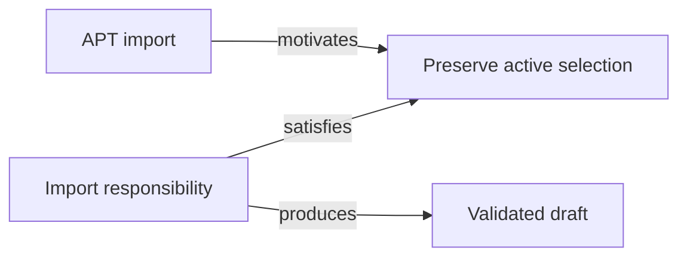
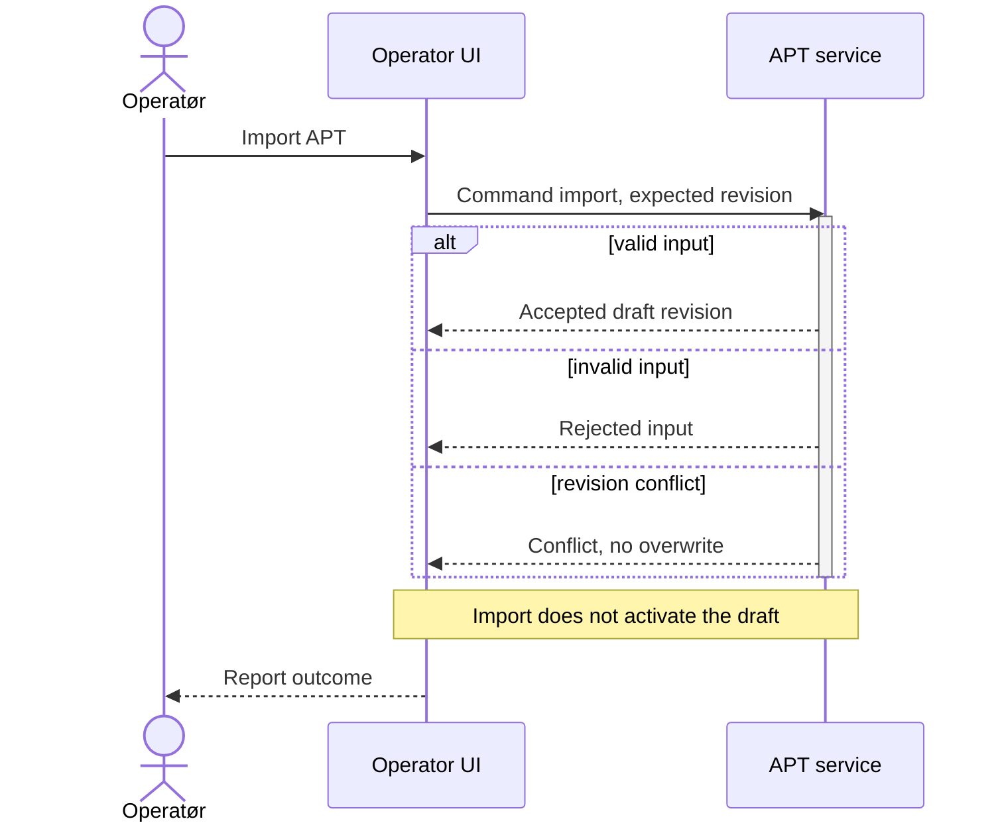
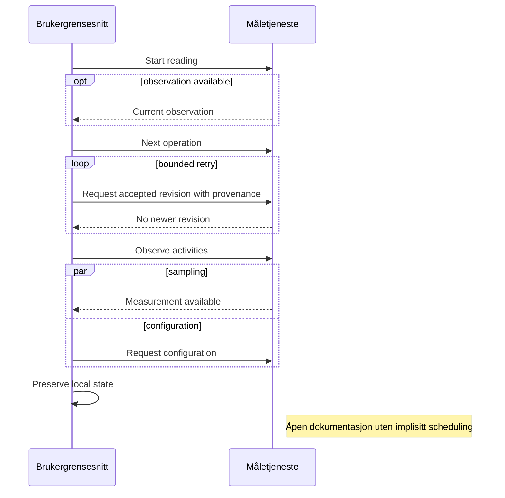
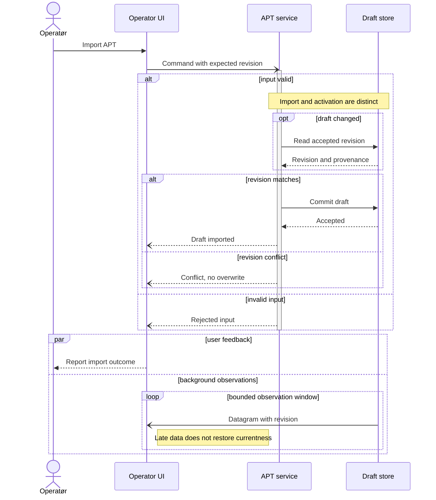
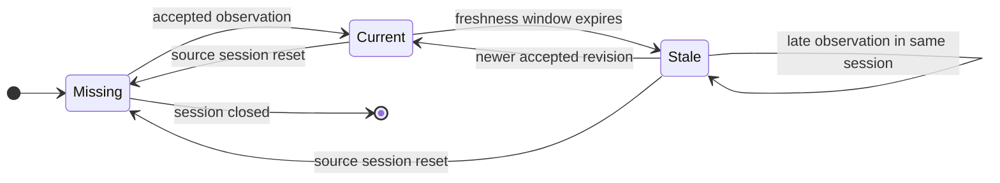
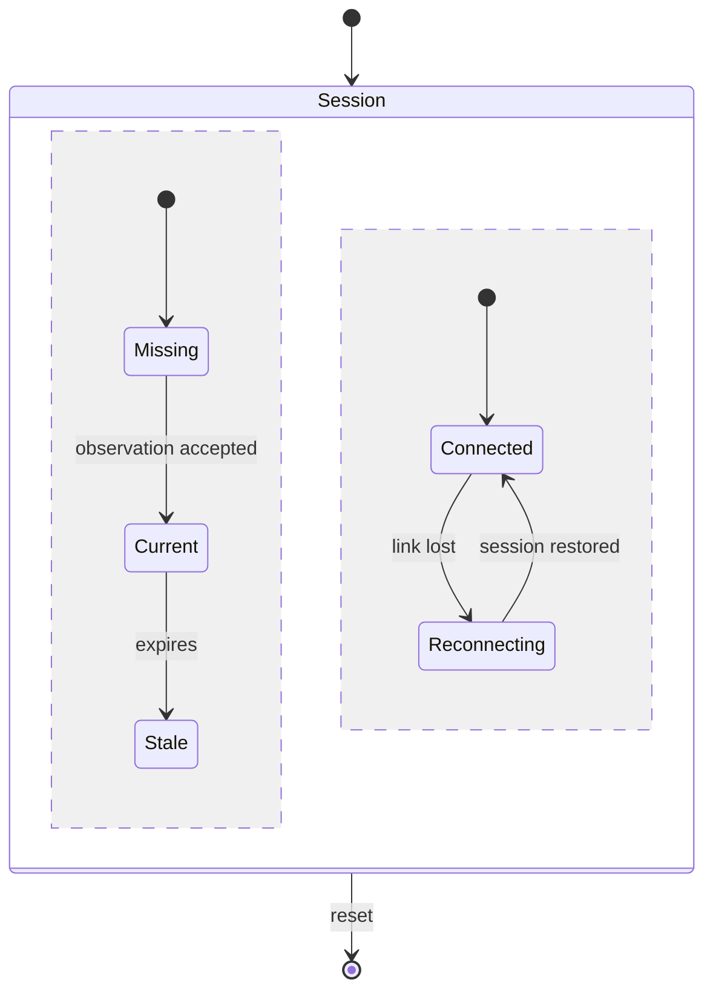
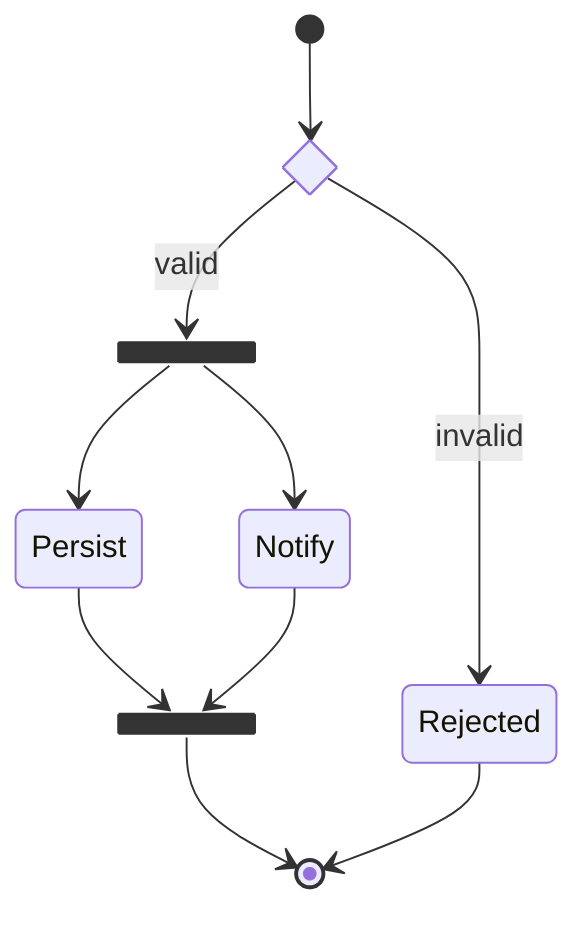
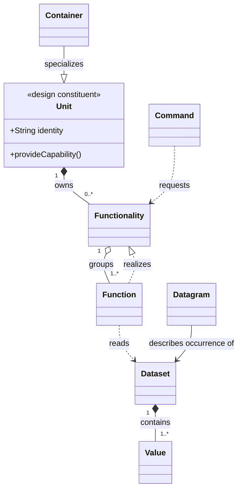
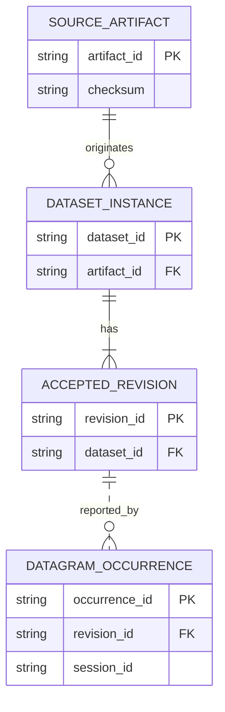

# Mermaid — praktiske eksempler i XFMD

Dette dokumentet oppdateres etter hvert implementert inkrement. Eksemplene
er forklarende SDL/SDP-kandidater, ikke vedtatt språk eller bevis for beståtte tester.
Start fra build-mappen med `./xfmd ../mermaid_evicence.md`.

## Flowchart — ansvar og krav



## Sequence 1 — APT-import

Import oppretter et utkast, men aktiverer det ikke. Aktiveringsbaren beskriver
aktivitet hos tjenesten, ikke aktivering av APT-utkastet eller en implisitt tråd.



## Sequence 1 — valg og samtidige aktiviteter

Parallelle fragmenter fastsetter ingen konkret scheduling.



## Sekvens: nestede forløp og asynkrone meldinger

Import er fortsatt forskjellig fra aktivering. Piler angir meldingsform, ikke scheduling.



## State — målingens aktualitet

En sen observasjon beholder Stale; source-session-reset er en egen overgang. Vakter evalueres ikke.



## State — samtidige regioner

To regioner beskriver logiske tilstander, ikke automatisk to tråder.



## State — choice, fork og join

Forgrening og samling vises eksplisitt.



## Class — kandidatmetamodell

Eierskap, bruk og realisering er forskjellige relasjoner. Dette vedtar ingen SDL-regler.



## Requirement — APT-import

Verifies kobler testspesifikasjon til krav; diagrammet hevder ikke at testen har bestått.

```mermaid
requirementDiagram
    requirement ImportAPT {
        id: APT-001
        text: "Import validates input and expected revision"
        risk: high
        verifymethod: test
    }
    functionalRequirement RejectConflict {
        id: APT-002
        text: "Reject stale expected revision without overwriting"
        risk: high
        verifymethod: test
    }
    element ImportService {
        type: service responsibility
        docref: design proposal
    }
    element ConflictTest {
        type: test specification
        docref: acceptance example
    }
    ImportService - satisfies -> ImportAPT
    ConflictTest - verifies -> RejectConflict
    RejectConflict - refines -> ImportAPT
    ImportService - traces -> RejectConflict
```

## ER — proveniens

Dataset-instans og Datagram-forekomst har ulike identiteter og er ikke nødvendigvis én til én.


