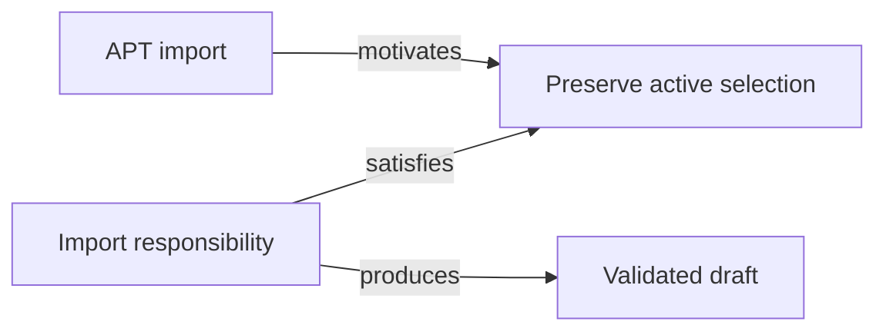
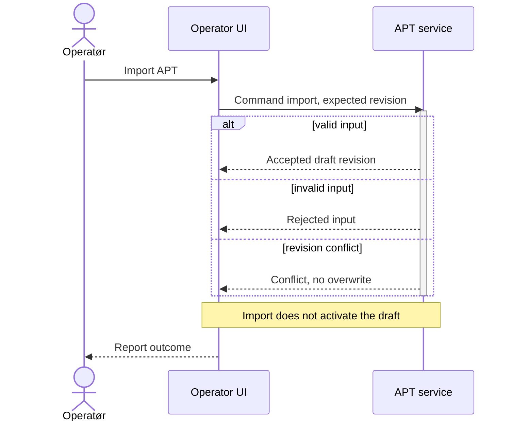
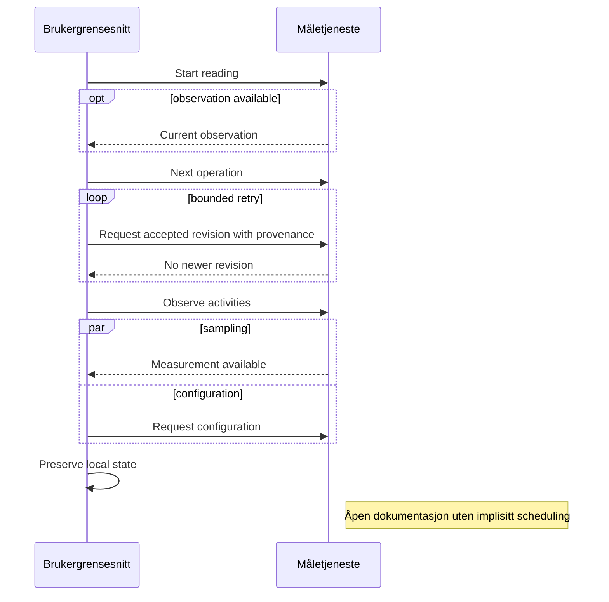

# Mermaid — praktiske eksempler i XFMD

Dette dokumentet oppdateres etter hvert implementert inkrement. Eksemplene
er forklarende SDL/SDP-kandidater, ikke vedtatt språk eller bevis for beståtte tester.
Start fra build-mappen med `./xfmd ../mermaid_evicence.md`.

## Flowchart — ansvar og krav

## Sequence 1 — APT-import

Import oppretter et utkast, men aktiverer det ikke. Aktiveringsbaren beskriver
aktivitet hos tjenesten, ikke aktivering av APT-utkastet eller en implisitt tråd.

## Sequence 1 — valg og samtidige aktiviteter

Parallelle fragmenter fastsetter ingen konkret scheduling.

