# Mermaid — praktiske eksempler i XFMD

Dette dokumentet viser 29 eksempler som dekker 23 diagramfamilier i den låste avhengigheten.
Profilene er avgrensede; se [støttematrisen](docs/design/mermaid-coverage.md). Eksemplene
er forklarende SDL/SDP-kandidater, ikke vedtatt språk eller bevis for beståtte tester.
Start fra build-mappen med `./xfmd ../mermaid_evicence.md`.

## Flowchart — ansvar og krav

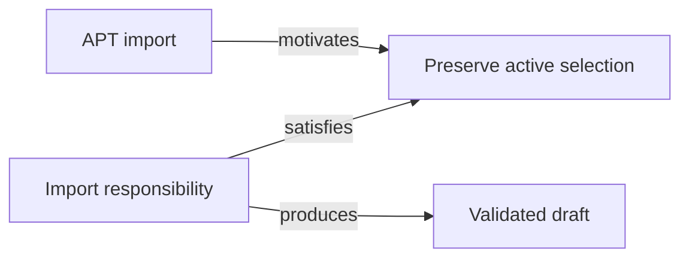
```mermaid
flowchart LR
    UC[APT import] -->|motivates| R[Preserve active selection]
    F[Import responsibility] -->|satisfies| R
    F -->|produces| D[Validated draft]
```

## Sequence 1 — APT-import

Import oppretter et utkast, men aktiverer det ikke. Aktiveringsbaren beskriver
aktivitet hos tjenesten, ikke aktivering av APT-utkastet eller en implisitt tråd.

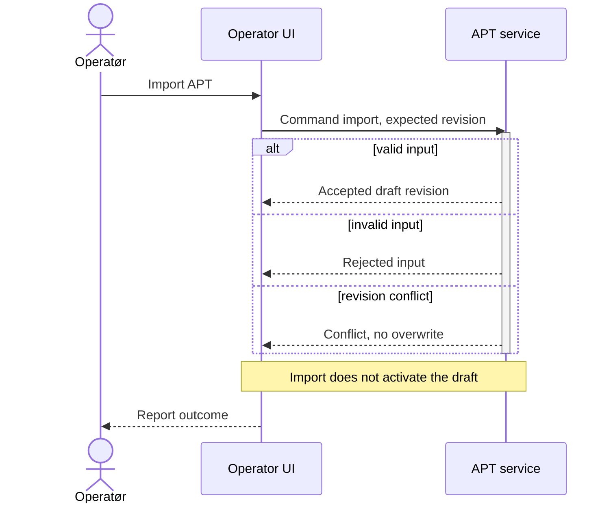
```mermaid
sequenceDiagram
    actor Operator as Operatør
    participant UI as Operator UI
    participant Service as APT service
    Operator->>UI: Import APT
    UI->>Service: Command import, expected revision
    activate Service
    alt valid input
        Service-->>UI: Accepted draft revision
    else invalid input
        Service-->>UI: Rejected input
    else revision conflict
        Service-->>UI: Conflict, no overwrite
    end
    deactivate Service
    Note over UI,Service: Import does not activate the draft
    UI-->>Operator: Report outcome
```

## Sequence 1 — valg og samtidige aktiviteter

Parallelle fragmenter fastsetter ingen konkret scheduling.

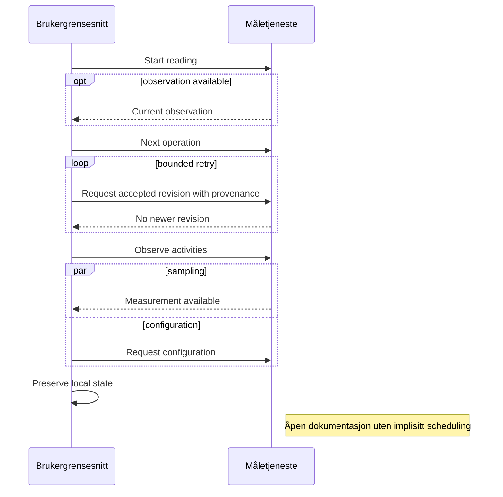
```mermaid
sequenceDiagram
    participant UI as Brukergrensesnitt
    participant Service as Måletjeneste
    UI->>Service: Start reading
    opt observation available
        Service-->>UI: Current observation
    end
    UI->>Service: Next operation
    loop bounded retry
        UI->>Service: Request accepted revision with provenance
        Service-->>UI: No newer revision
    end
    UI->>Service: Observe activities
    par sampling
        Service-->>UI: Measurement available
    and configuration
        UI->>Service: Request configuration
    end
    UI->>UI: Preserve local state
    Note right of Service: Åpen dokumentasjon uten implisitt scheduling
```

## Sekvens: nestede forløp og asynkrone meldinger

Import er fortsatt forskjellig fra aktivering. Piler angir meldingsform, ikke scheduling.

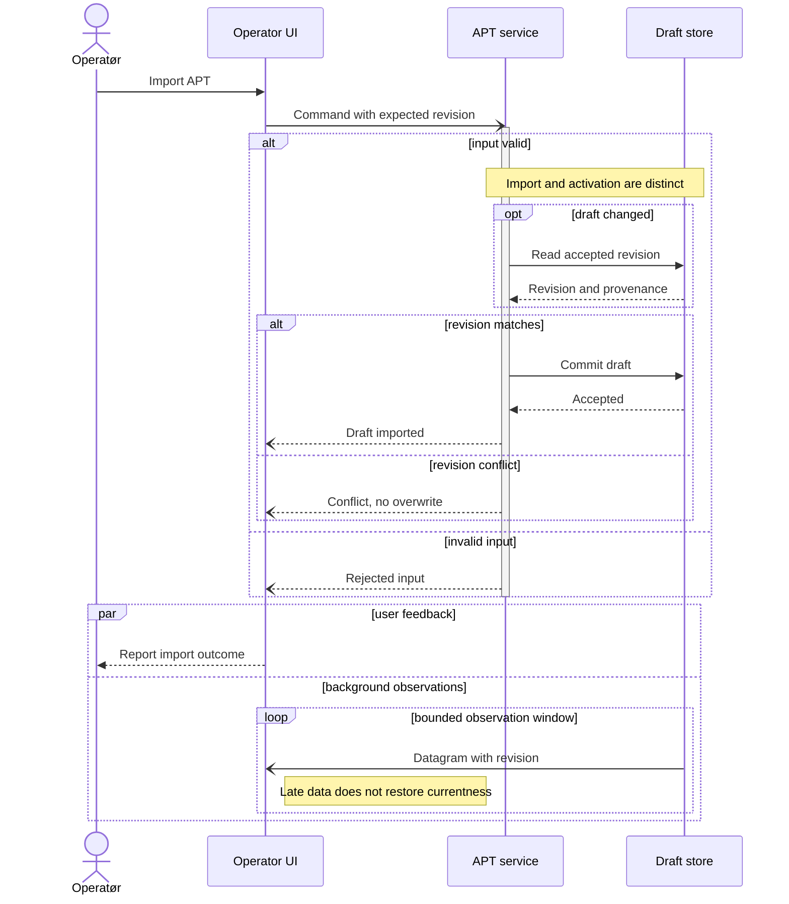
```mermaid
sequenceDiagram
    actor Operator as Operatør
    participant UI as Operator UI
    participant Service as APT service
    participant Store as Draft store
    Operator->>UI: Import APT
    UI-)Service: Command with expected revision
    activate Service
    alt input valid
        Note over Service,Store: Import and activation are distinct
        opt draft changed
            Service->>Store: Read accepted revision
            Store-->>Service: Revision and provenance
        end
        alt revision matches
            Service->>Store: Commit draft
            Store-->>Service: Accepted
            Service--)UI: Draft imported
        else revision conflict
            Service--)UI: Conflict, no overwrite
        end
    else invalid input
        Service--)UI: Rejected input
    end
    deactivate Service
    par user feedback
        UI-->>Operator: Report import outcome
    and background observations
        loop bounded observation window
            Store-)UI: Datagram with revision
            Note right of UI: Late data does not restore currentness
        end
    end
```

## State — målingens aktualitet

En sen observasjon beholder Stale; source-session-reset er en egen overgang. Vakter evalueres ikke.

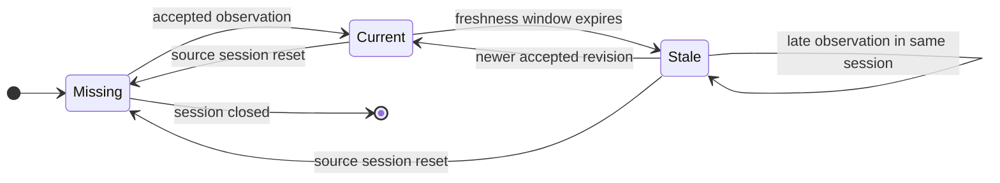
```mermaid
stateDiagram-v2
    direction LR
    [*] --> Missing
    Missing --> Current : accepted observation
    Current --> Stale : freshness window expires
    Stale --> Stale : late observation in same session
    Stale --> Current : newer accepted revision
    Current --> Missing : source session reset
    Stale --> Missing : source session reset
    Missing --> [*] : session closed
```

## State — samtidige regioner

To regioner beskriver logiske tilstander, ikke automatisk to tråder.

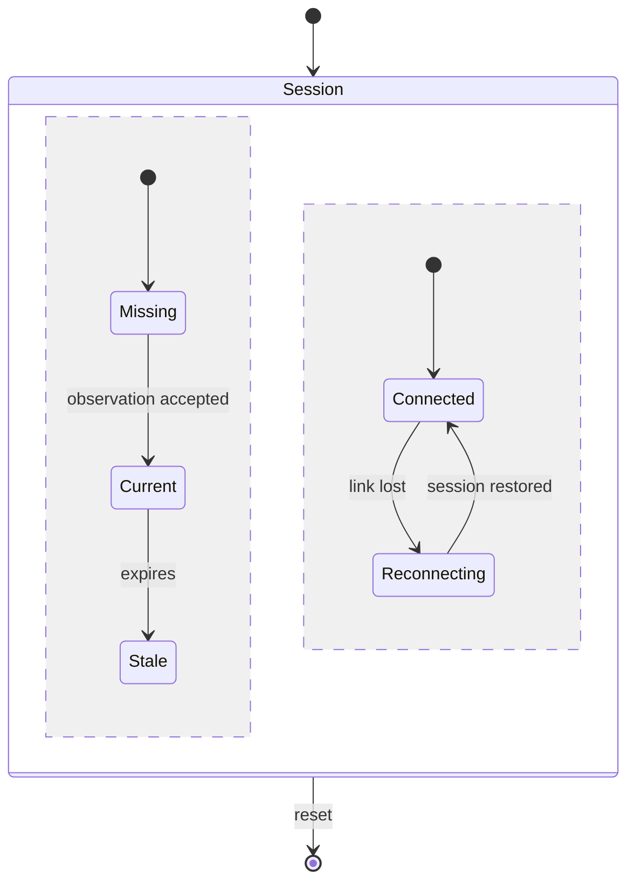
```mermaid
stateDiagram-v2
    [*] --> Session
    state Session {
        [*] --> Missing
        Missing --> Current : observation accepted
        Current --> Stale : expires
        --
        [*] --> Connected
        Connected --> Reconnecting : link lost
        Reconnecting --> Connected : session restored
    }
    Session --> [*] : reset
```

## State — choice, fork og join

Forgrening og samling vises eksplisitt.

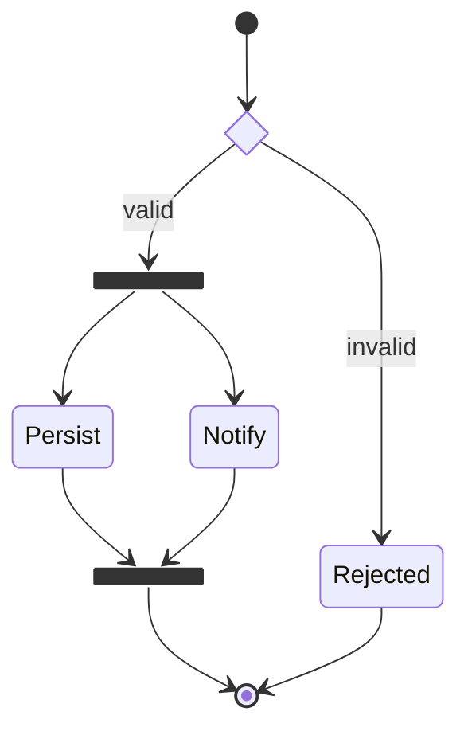
```mermaid
stateDiagram-v2
    state Valid <<choice>>
    state Fanout <<fork>>
    state Joined <<join>>
    [*] --> Valid
    Valid --> Rejected : invalid
    Valid --> Fanout : valid
    Fanout --> Persist
    Fanout --> Notify
    Persist --> Joined
    Notify --> Joined
    Joined --> [*]
    Rejected --> [*]
```

## Class — kandidatmetamodell

Eierskap, bruk og realisering er forskjellige relasjoner. Dette vedtar ingen SDL-regler.

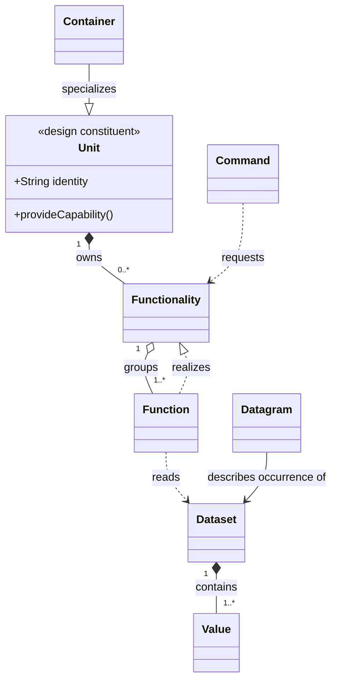
```mermaid
classDiagram
    direction TB
    class Unit {
        <<design constituent>>
        +String identity
        +provideCapability()
    }
    class Container
    class Functionality
    class Function
    class Dataset
    class Datagram
    class Command
    class Value
    Container --|> Unit : specializes
    Unit "1" *-- "0..*" Functionality : owns
    Functionality "1" o-- "1..*" Function : groups
    Function ..|> Functionality : realizes
    Function ..> Dataset : reads
    Datagram --> Dataset : describes occurrence of
    Command ..> Functionality : requests
    Dataset "1" *-- "1..*" Value : contains
```

## Requirement — APT-import

Verifies kobler testspesifikasjon til krav; diagrammet hevder ikke at testen har bestått.

```mermaid
requirementDiagram
    requirement ImportAPT {
        id: APT-001
        text: "Import validates input and expected revision"
        risk: high
        verifymethod: test
    }
    functionalRequirement RejectConflict {
        id: APT-002
        text: "Reject stale expected revision without overwriting"
        risk: high
        verifymethod: test
    }
    element ImportService {
        type: service responsibility
        docref: design proposal
    }
    element ConflictTest {
        type: test specification
        docref: acceptance example
    }
    ImportService - satisfies -> ImportAPT
    ConflictTest - verifies -> RejectConflict
    RejectConflict - refines -> ImportAPT
    ImportService - traces -> RejectConflict
```

## ER — proveniens

Dataset-instans og Datagram-forekomst har ulike identiteter og er ikke nødvendigvis én til én.

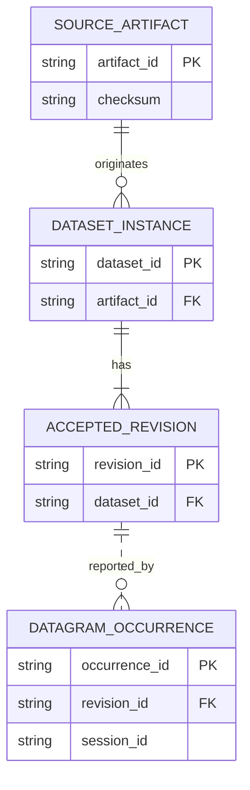
```mermaid
erDiagram
    SOURCE_ARTIFACT {
        string artifact_id PK
        string checksum
    }
    DATASET_INSTANCE {
        string dataset_id PK
        string artifact_id FK
    }
    ACCEPTED_REVISION {
        string revision_id PK
        string dataset_id FK
    }
    DATAGRAM_OCCURRENCE {
        string occurrence_id PK
        string revision_id FK
        string session_id
    }
    SOURCE_ARTIFACT ||--o{ DATASET_INSTANCE : originates
    DATASET_INSTANCE ||--|{ ACCEPTED_REVISION : has
    ACCEPTED_REVISION ||..o{ DATAGRAM_OCCURRENCE : reported_by
```

## C4 — kontekst

Dette er en dokumentasjonsvisning, ikke en vedtatt SDL-definisjon.

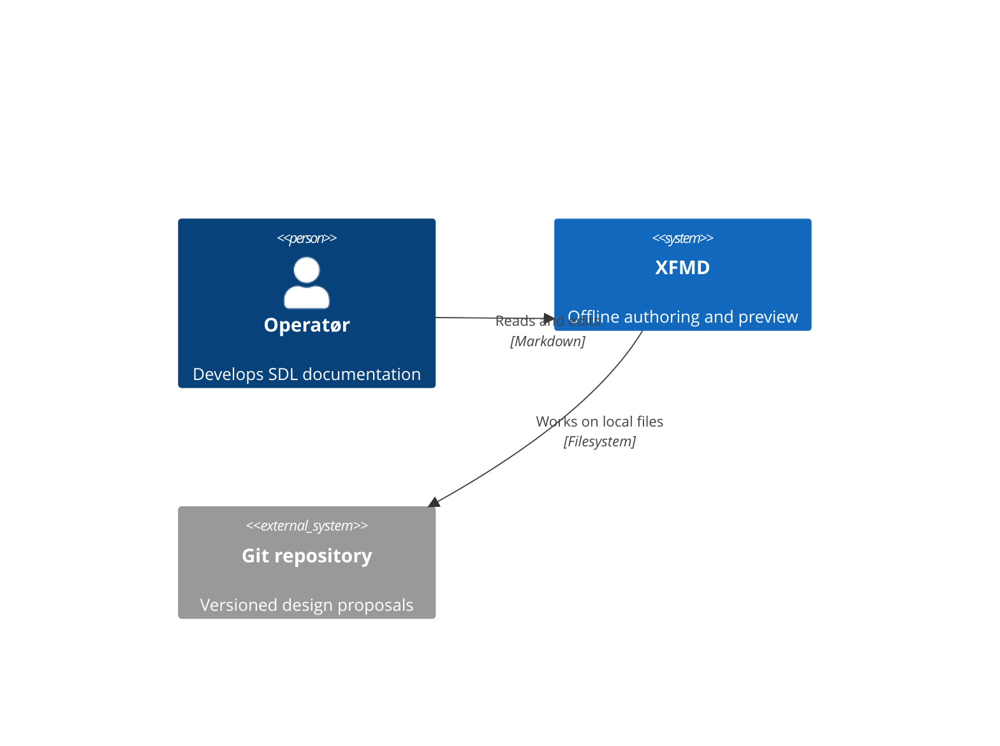
```mermaid
C4Context
Person(operator, "Operatør", "Develops SDL documentation")
System(xfmd, "XFMD", "Offline authoring and preview")
System_Ext(repository, "Git repository", "Versioned design proposals")
Rel(operator, xfmd, "Reads and edits", "Markdown")
Rel(xfmd, repository, "Works on local files", "Filesystem")
```

## C4 — containere

Dette er en dokumentasjonsvisning, ikke en vedtatt SDL-definisjon.

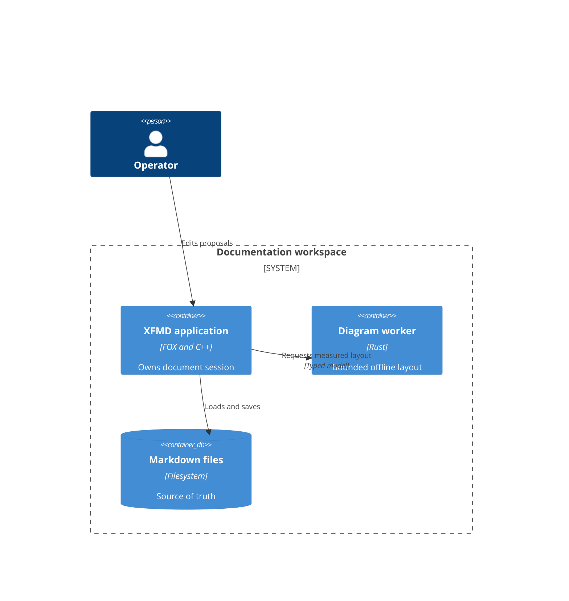
```mermaid
C4Container
Person(operator, "Operator")
System_Boundary(system, "Documentation workspace") {
Container(app, "XFMD application", "FOX and C++", "Owns document session")
Container(preview, "Diagram worker", "Rust", "Bounded offline layout")
ContainerDb(files, "Markdown files", "Filesystem", "Source of truth")
}
Rel(operator, app, "Edits proposals")
Rel(app, preview, "Requests measured layout", "Typed model")
Rel(app, files, "Loads and saves")
```

## C4 — komponenter

Dette er en dokumentasjonsvisning, ikke en vedtatt SDL-definisjon.

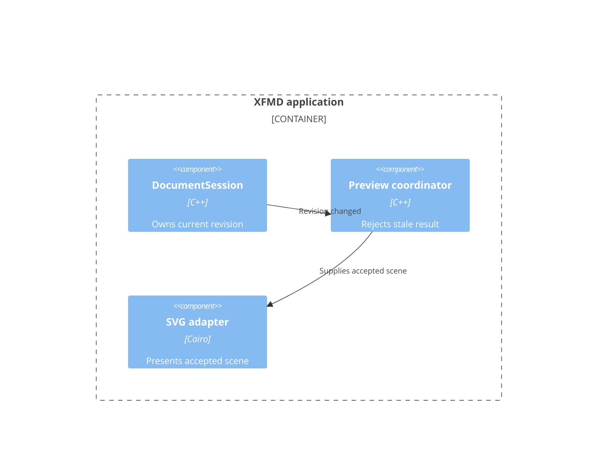
```mermaid
C4Component
Container_Boundary(application, "XFMD application") {
Component(session, "DocumentSession", "C++", "Owns current revision")
Component(coordinator, "Preview coordinator", "C++", "Rejects stale result")
Component(adapter, "SVG adapter", "Cairo", "Presents accepted scene")
}
Rel(session, coordinator, "Revision changed")
Rel(coordinator, adapter, "Supplies accepted scene")
```

## Architecture — lokale ressurser

Dette er en dokumentasjonsvisning, ikke en vedtatt SDL-definisjon.

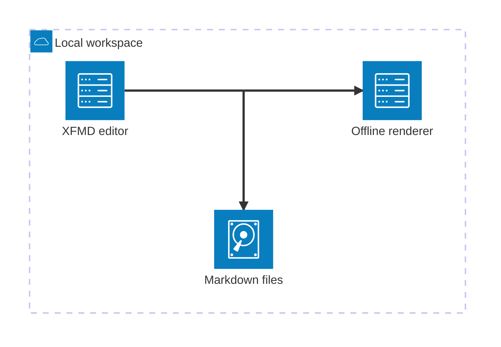
```mermaid
architecture-beta
group workspace(cloud)[Local workspace]
service editor(server)[XFMD editor] in workspace
service files(disk)[Markdown files] in workspace
service renderer(server)[Offline renderer] in workspace
junction bus in workspace
editor:R -- L:bus
bus:R --> L:renderer
bus:B --> T:files
```

## Block — horisontale lag

Dette er en dokumentasjonsvisning, ikke en vedtatt SDL-definisjon.

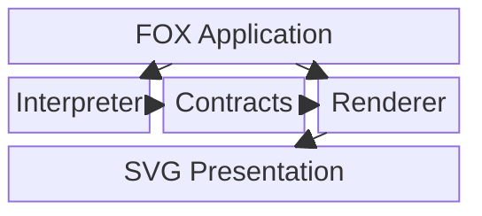
```mermaid
block-beta
columns 3
application["FOX Application"]:3
interpreter["Interpreter"]
contracts["Contracts"]
renderer["Renderer"]
presentation["SVG Presentation"]:3
application --> interpreter
application --> renderer
interpreter --> contracts
contracts --> renderer
renderer --> presentation
```

## Packet — konkret wire-encoding

Et eksempel på konkrete feltbredder; dette definerer ikke SDL Datagram.

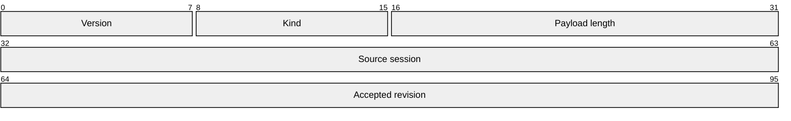
```mermaid
packet
0-7: "Version"
8-15: "Kind"
16-31: "Payload length"
32-63: "Source session"
64-95: "Accepted revision"
```

## Timeline — checkpoint-historikk

Ordnet kategorisk tid, ikke en proporsjonal kalenderakse.

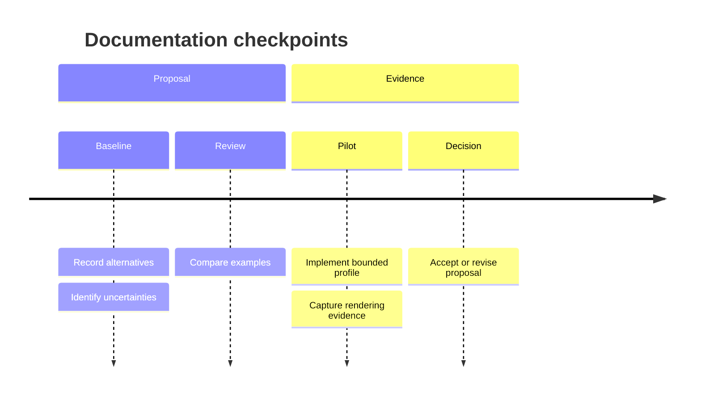
```mermaid
timeline
    title Documentation checkpoints
    section Proposal
    Baseline : Record alternatives : Identify uncertainties
    Review : Compare examples
    section Evidence
    Pilot : Implement bounded profile : Capture rendering evidence
    Decision : Accept or revise proposal
```

## Gantt — foreslått pilot

Et planforslag, ikke faktisk fremdrift eller vedtatt SDP-prosess.

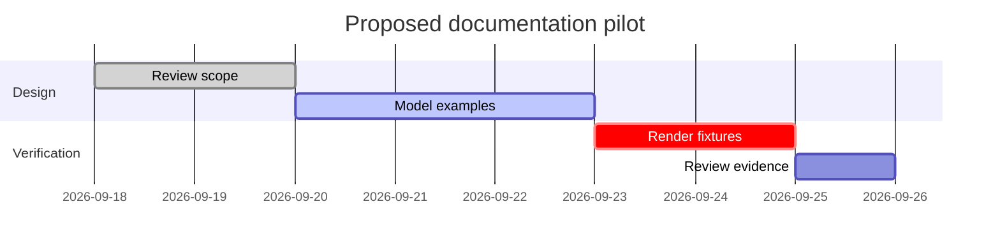
```mermaid
gantt
    title Proposed documentation pilot
    dateFormat YYYY-MM-DD
    section Design
    Review scope : done, scope, 2026-09-18, 2d
    Model examples : active, model, after scope, 3d
    section Verification
    Render fixtures : crit, render, after model, 2d
    Review evidence : review, after render, 1d
```

## Journey — dokumentgjennomgang

Score beskriver en illustrert opplevelse, ikke systemets korrekthet.

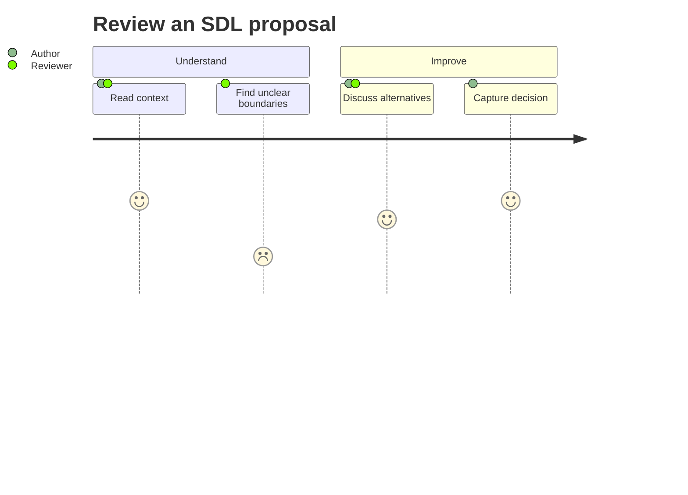
```mermaid
journey
    title Review an SDL proposal
    section Understand
    Read context : 5 : Author, Reviewer
    Find unclear boundaries : 2 : Reviewer
    section Improve
    Discuss alternatives : 4 : Author, Reviewer
    Capture decision : 5 : Author
```

## Pie — evidenskategorier

Illustrative antall, ikke resultatene fra denne testkjøringen.

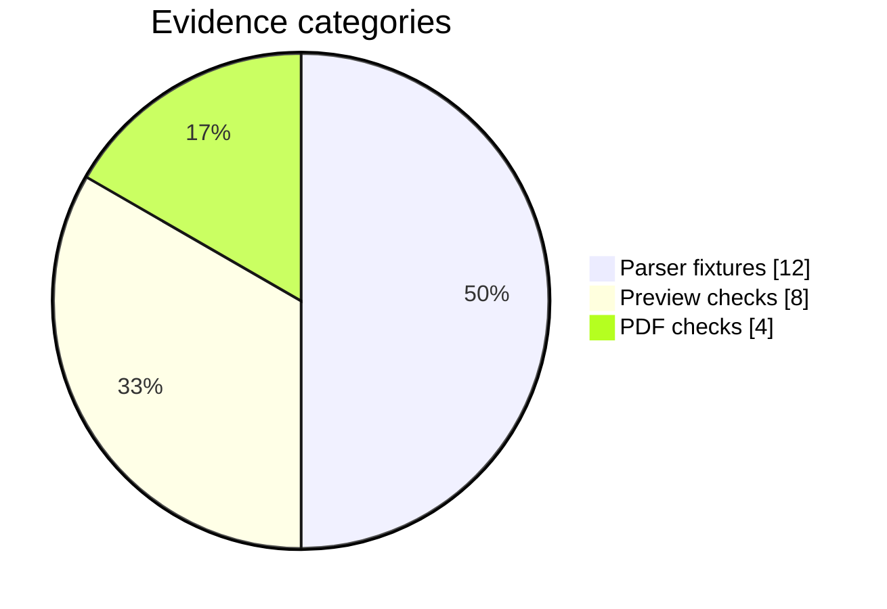
```mermaid
pie showData
    title Evidence categories
    "Parser fixtures" : 12
    "Preview checks" : 8
    "PDF checks" : 4
```

## Mindmap — gjennomgang

Et utforskende tankekart.

```mermaid
mindmap
  root((Design review))
    boundaries[Boundaries]
      Ownership
      Channels
    evidence(Evidence)
      Scenarios
      Rendering
```

## GitGraph — forslag og review

En illustrert versjonshistorikk, ikke en Git-operasjon.

```mermaid
gitGraph
    commit id:"baseline"
    branch proposal
    checkout proposal
    commit id:"design"
    commit id:"evidence"
    checkout main
    commit id:"review"
    merge proposal
```

## Sankey — fordeling av forekomster

Illustrative mengder; ikke en påstand om én-til-én Dataset–Datagram.

```mermaid
sankey-beta
Source artifacts,Validated datasets,12
Validated datasets,Accepted revisions,9
Validated datasets,Rejected candidates,3
Accepted revisions,Datagram occurrences,9
```

## Quadrant — prioriteringer

Plasseringene er forslag til diskusjon.

```mermaid
quadrantChart
    title Proposed review priorities
    x-axis Low uncertainty --> High uncertainty
    y-axis Low impact --> High impact
    quadrant-1 Investigate
    quadrant-2 Protect
    quadrant-3 Observe
    quadrant-4 Clarify
    Session reset : [0.75, 0.85]
    Label appearance : [0.25, 0.2]
    Ownership rules : [0.3, 0.8]
```

## ZenUML — asynkrone observasjoner

Åpne piler beskriver asynkrone meldinger uten å fastsette scheduling.

```mermaid
zenuml
    Sensor as Measurement source
    Service as Measurement service
    UI as Operator UI
    Sensor->Service: Observation with session and revision
    Service->UI: Current value notification
    Sensor->Service: Late observation
    Service->UI: Stale value retained
```

## Kanban — dokumentarbeid

En oversikt over arbeidsobjekter, ikke en obligatorisk prosess.

```mermaid
kanban
  proposed[Proposed]
    boundaries[Clarify system boundaries]
    ports[Review typed ports]
  evidence[Evidence]
    fixtures[Render acceptance fixtures]
  reviewed[Reviewed]
    provenance[Document provenance decision]
```

## Radar — illustrerte vurderinger

Skalaen 0–5 er et eksempel, ikke målte kvalitetspoeng.

```mermaid
radar-beta
    title Illustrative review scores
    axis syntax[Syntax], semantics[Semantics], reading[Readability], evidence[Evidence]
    curve before[Before]{3, 2, 2, 1}
    curve after[After]{4, 4, 3, 4}
    min 0
    max 5
    graticule polygon
```

## Treemap — illustrert innsats

Arealene er proporsjonale med bladverdiene.

```mermaid
treemap-beta
  "Documentation"
    "Design"
      "Boundaries": 30
      "Contracts": 25
    "Verification"
      "Fixtures": 20
      "Visual review": 15
      "PDF": 10
```

## XYChart — sammenligning

Illustrerte antall; søyler og linje er forskjellige serier.

```mermaid
xychart-beta
    title Illustrative evidence counts
    x-axis [Parser, Model, Preview, PDF]
    y-axis "Checks" 0 --> 20
    bar [18, 12, 10, 8]
    line [12, 10, 8, 6]
```
