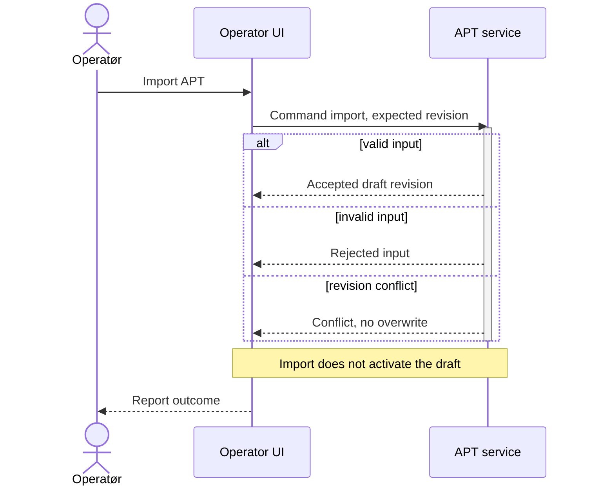
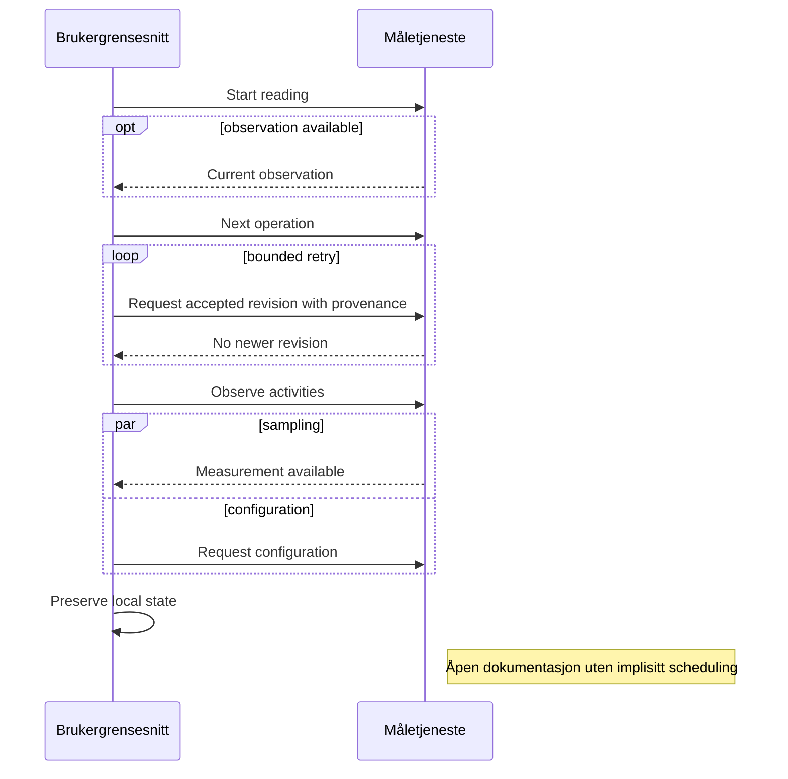
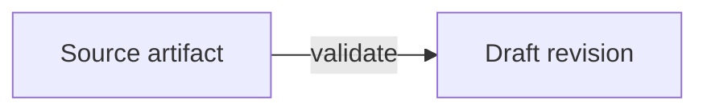

# SDL/SDP — sekvensvisninger (kandidateksempler)

Dette er dokumentasjonseksempler, ikke vedtatt SDL eller kjørbar logikk.

## APT-import

Import oppretter et validert utkast; valg av aktiv APT er en separat handling.

## Parallelle aktiviteter og repetisjon

Deltakere beskriver ansvar, ikke implisitte tråder eller scheduling.

## Eksisterende flowchart

Vanlig Markdown etter diagrammene kan fortsatt merkes og kopieres.
