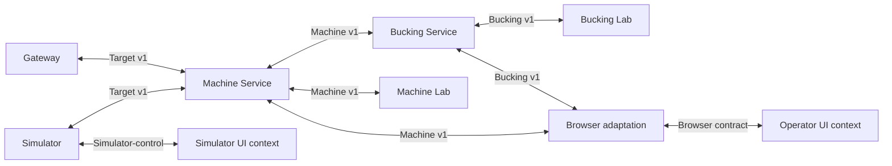
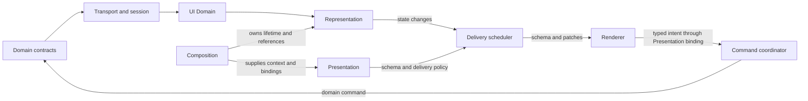
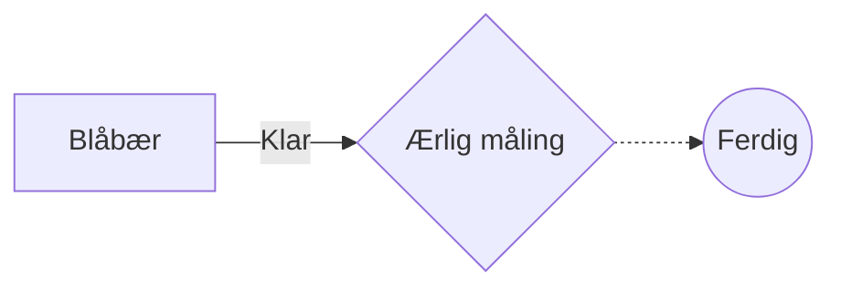

# Mermaid-diagrammer

Native diagrammer med kopierbar tekst.

```mermaid
flowchart LR
    SIM[Simulator] <-->|Target v1| MCH[Machine Service]
    PGW[Gateway] <-->|Target v1| MCH
    MCH <-->|Machine v1| BKS[Bucking Service]
    MCH <-->|Machine v1| MLB[Machine Lab]
    BKS <-->|Bucking v1| BLB[Bucking Lab]
    MCH <-->|Machine v1| BWEB[Browser adaptation]
    BKS <-->|Bucking v1| BWEB
    BWEB <-->|Browser contract| OP[Operator UI context]
    SIM <-->|Simulator-control| SU[Simulator UI context]
```

```mermaid
flowchart LR
    D[Domain contracts] --> T[Transport and session]
    T --> U[UI Domain]
    U --> R[Representation]
    C[Composition] -->|owns lifetime and references| R
    C -->|supplies context and bindings| P[Presentation]
    P -->|schema and delivery policy| S[Delivery scheduler]
    R -->|state changes| S
    S -->|schema and patches| V[Renderer]
    V -->|typed intent through Presentation binding| Q[Command coordinator]
    Q -->|domain command| D
```

```mermaid
flowchart LR
A[Blåbær] -->|Klar| B{Ærlig måling}
B -.-> C((Ferdig))
```
