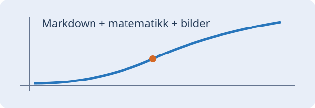

# Matematikk og bilder

Merk denne **teksten**, og kopier med **Ctrl+C**. Norsk tekst: blåbær, æøå.

En formel i løpende tekst: $E = mc^2$. En brøk: $\frac{a_1 + b_2}{\sqrt{c}}$.

## Formler på egen linje

$$
\sum_{i=1}^{n} i = \frac{n(n+1)}{2}
$$

\[\begin{pmatrix} a & b \\ c & d \end{pmatrix}\]

```math
\int_0^1 x^2\,dx = \frac{1}{3}
```

## Lokal illustrasjon



[Tilbake til eksempeldokumentet](basics.md).

Kode beholder sin opprinnelige form: `$x^2$`.
